# ⚙️ Evolutionary Engine Teardown: Live Execution Trace (Email 1783)
This visualizer acts as an X-Ray of the pipeline, showing the exact data payloads moving through the FSM (Finite State Machine).
## Engine State Diagram
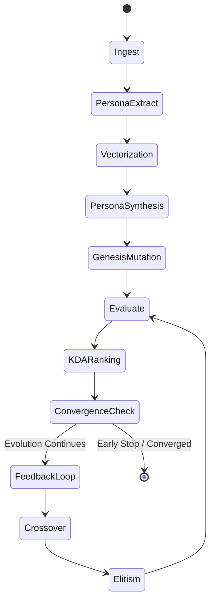

---

## 🧩 Step01_Ingest
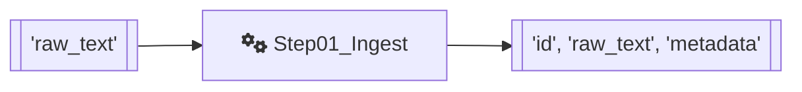
### 📥 Input Payloads to Engine:
```json
{
  "raw_text": "Lynn,  I was ask to make a selection between Amy and Christine to do testing for the  new accounting project.\nWhich will take up to 50% of their time away from the team.\nMy recommendation to you and Rick Dietz was Christine McEvoy to be the selected individual to test on this project.\nIf you have any concerns on this matter please let me know.\nThank you.\nOne more thing, could we mention this in the next team leader meeting for all the individuals involved in this testing.\nTerry Kowalke"
}
```
### 📤 Output Payloads from Engine:
```json
{
  "id": "1783",
  "raw_text": "Lynn,  I was ask to make a selection between Amy and Christine to do testing for the  new accounting project.\nWhich will take up to 50% of their time away from the team.\nMy recommendation to you and Rick Dietz was Christine McEvoy to be the selected individual to test on this project.\nIf you have any concerns on this matter please let me know.\nThank you.\nOne more thing, could we mention this in the next team leader meeting for all the individuals involved in this testing.\nTerry Kowalke",
  "metadata": {}
}
```
---

## 🧩 Step02_PersonaExtract
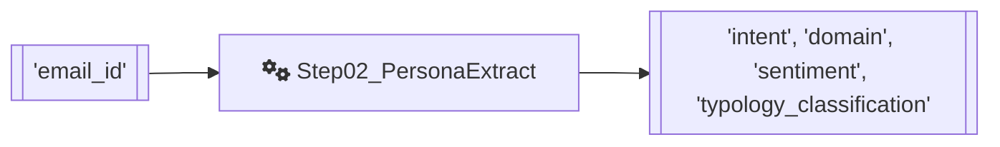
### 📥 Input Payloads to Engine:
```json
{
  "email_id": "1783"
}
```
### 📤 Output Payloads from Engine:
```json
{
  "intent": "Recommendation",
  "domain": "B2B Corporate",
  "sentiment": "Polite",
  "typology_classification": "B2B_Corporate_Polite_Recommendation"
}
```
---

## 🧩 Step03_Vectorization
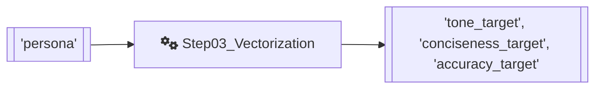
### 📥 Input Payloads to Engine:
```json
{
  "persona": {
    "intent": "Recommendation",
    "domain": "B2B Corporate",
    "sentiment": "Polite",
    "typology_classification": "B2B_Corporate_Polite_Recommendation"
  }
}
```
### 📤 Output Payloads from Engine:
```json
{
  "tone_target": 7.0,
  "conciseness_target": 7.5,
  "accuracy_target": 9.0
}
```
---

## 🧩 Step04_PersonaSynthesis
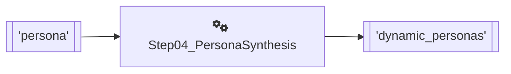
### 📥 Input Payloads to Engine:
```json
{
  "persona": {
    "intent": "Recommendation",
    "domain": "B2B Corporate",
    "sentiment": "Polite",
    "typology_classification": "B2B_Corporate_Polite_Recommendation"
  }
}
```
### 📤 Output Payloads from Engine:
```json
{
  "dynamic_personas": [
    "Terry the Team Player",
    "Lynn's Trusted Advisor",
    "Rick's Right-Hand Man",
    "Christine's Champion",
    "The B2B Project Orchestrator"
  ]
}
```
---

## 🧩 Step05_GenesisMutation (Generation 0)
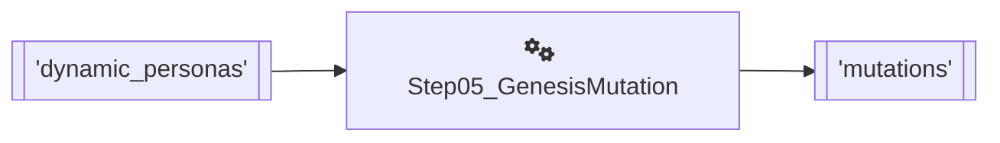
### 📥 Input Payloads to Engine:
```json
{
  "dynamic_personas": [
    "Terry the Team Player",
    "Lynn's Trusted Advisor",
    "Rick's Right-Hand Man",
    "Christine's Champion",
    "The B2B Project Orchestrator"
  ]
}
```
### 📤 Output Payloads from Engine:
```json
{
  "mutations": [
    {
      "id": "mut_gen0_0_ac6a",
      "typology_persona": "Terry the Team Player",
      "prompt_text": "Generate an email to Lynn recommending Christine McEvoy for the new accounting project testing, which will take up to 50% of the selected individual's time, and request discussion in the next team leader meeting",
      "generation_num": 0
    },
    {
      "id": "mut_gen0_1_2b9c",
      "typology_persona": "Lynn's Trusted Advisor",
      "prompt_text": "Write an email to Lynn regarding the selection of an individual to test the new accounting project, mentioning that the chosen person will have up to 50% of their time taken away from the team, and that the recommendation is Christine McEvoy, with a request for discussion in the next team leader meeting.",
      "generation_num": 0
    },
    {
      "id": "mut_gen0_2_f42c",
      "typology_persona": "Rick's Right-Hand Man",
      "prompt_text": "Generate an email to Lynn recommending Christine McEvoy for testing on the new accounting project, which will take up to 50% of their time, and requesting discussion in the next team leader meeting",
      "generation_num": 0
    },
    {
      "id": "mut_gen0_3_9c11",
      "typology_persona": "Christine's Champion",
      "prompt_text": "Generate an email to Lynn and Rick Dietz recommending Christine McEvoy for the new accounting project testing, which will take up to 50% of her time, and request to discuss this in the next team leader meeting.",
      "
... [truncated for readability]
```
---

## 🧩 Step06_Evaluate (Generation 0)
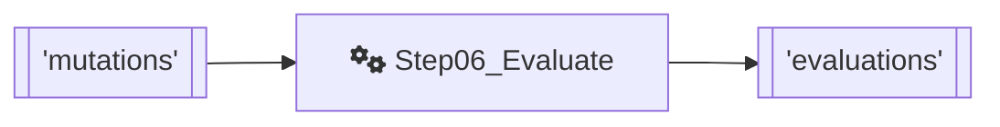
### 📥 Input Payloads to Engine:
```json
{
  "mutations": [
    {
      "id": "mut_gen0_0_ac6a",
      "typology_persona": "Terry the Team Player",
      "prompt_text": "Generate an email to Lynn recommending Christine McEvoy for the new accounting project testing, which will take up to 50% of the selected individual's time, and request discussion in the next team leader meeting",
      "generation_num": 0
    },
    {
      "id": "mut_gen0_1_2b9c",
      "typology_persona": "Lynn's Trusted Advisor",
      "prompt_text": "Write an email to Lynn regarding the selection of an individual to test the new accounting project, mentioning that the chosen person will have up to 50% of their time taken away from the team, and that the recommendation is Christine McEvoy, with a request for discussion in the next team leader meeting.",
      "generation_num": 0
    },
    {
      "id": "mut_gen0_2_f42c",
      "typology_persona": "Rick's Right-Hand Man",
      "prompt_text": "Generate an email to Lynn recommending Christine McEvoy for te
... [truncated for readability]
```
### 📤 Output Payloads from Engine:
```json
{
  "evaluations": [
    {
      "mutation_id": "mut_gen0_0_ac6a",
      "prompt_text": "Generate an email to Lynn recommending Christine McEvoy for the new accounting project testing, which will take up to 50% of the selected individual's time, and request discussion in the next team leader meeting",
      "synthetic_text": "Subject: Recommendation for Accounting Project Testing - Christine McEvoy\nDear Lynn,\nI am writing to highly recommend Christine McEvoy for the new accounting project testing. I believe her skills and expertise would be a great asset to this project. As you know, this project will require a significant time commitment, up to 50% of the selected individual's time. I think Christine would be an excellent fit for this role.\nI would like to request that we discuss this further in our next team leader meeting. I believe it would be beneficial to hear everyone's thoughts and opinions on this matter.\nPlease let me know if this is something we can add to the agenda.\nBest regards,",
      "tone_score": 9.0,
      "conciseness_score": 7.0,
      "accuracy_score": 8.0,
      "tone_delta": 2.0,
      "conciseness_delta": 0.5,
      "accuracy_delta": 1.0,
      "persona_deviation_penalty": 0.0,
      "overall_delta": 3.5
    },
    {
      "mutation_id": "mut_gen0_1_2b9c",
      "prompt_text": "Write an email to Lynn regarding the selection of an individual to test the new accounting project, mentioning that the chosen person will have up to 50% of their time tak
... [truncated for readability]
```
---

## 🧩 Step07_KDARanking (Generation 0)
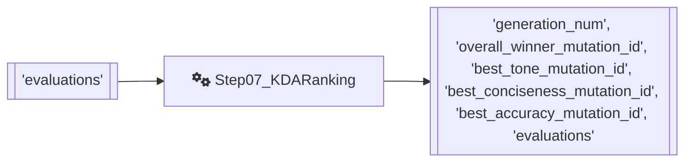
### 📥 Input Payloads to Engine:
```json
{
  "evaluations": [
    {
      "mutation_id": "mut_gen0_0_ac6a",
      "prompt_text": "Generate an email to Lynn recommending Christine McEvoy for the new accounting project testing, which will take up to 50% of the selected individual's time, and request discussion in the next team leader meeting",
      "synthetic_text": "Subject: Recommendation for Accounting Project Testing - Christine McEvoy\nDear Lynn,\nI am writing to highly recommend Christine McEvoy for the new accounting project testing. I believe her skills and expertise would be a great asset to this project. As you know, this project will require a significant time commitment, up to 50% of the selected individual's time. I think Christine would be an excellent fit for this role.\nI would like to request that we discuss this further in our next team leader meeting. I believe it would be beneficial to hear everyone's thoughts and opinions on this matter.\nPlease let me know if this is something we can add to the agenda.\nB
... [truncated for readability]
```
### 📤 Output Payloads from Engine:
```json
{
  "generation_num": 0,
  "overall_winner_mutation_id": "mut_gen0_0_ac6a",
  "best_tone_mutation_id": "mut_gen0_2_f42c",
  "best_conciseness_mutation_id": "mut_gen0_0_ac6a",
  "best_accuracy_mutation_id": "mut_gen0_3_9c11",
  "evaluations": [
    {
      "mutation_id": "mut_gen0_0_ac6a",
      "prompt_text": "Generate an email to Lynn recommending Christine McEvoy for the new accounting project testing, which will take up to 50% of the selected individual's time, and request discussion in the next team leader meeting",
      "synthetic_text": "Subject: Recommendation for Accounting Project Testing - Christine McEvoy\nDear Lynn,\nI am writing to highly recommend Christine McEvoy for the new accounting project testing. I believe her skills and expertise would be a great asset to this project. As you know, this project will require a significant time commitment, up to 50% of the selected individual's time. I think Christine would be an excellent fit for this role.\nI would like to request that we discuss this further in our next team leader meeting. I believe it would be beneficial to hear everyone's thoughts and opinions on this matter.\nPlease let me know if this is something we can add to the agenda.\nBest regards,",
      "tone_score": 9.0,
      "conciseness_score": 7.0,
      "accuracy_score": 8.0,
      "tone_delta": 2.0,
      "conciseness_delta": 0.5,
      "accuracy_delta": 1.0,
      "persona_deviation_penalty": 0.0,
      "overall_delta": 3.5
    },
    {
      "mut
... [truncated for readability]
```
---

## 🧩 Step08_FeedbackLoop (Generation 0)
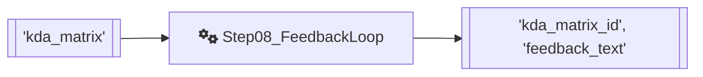
### 📥 Input Payloads to Engine:
```json
{
  "kda_matrix": {
    "generation_num": 0,
    "overall_winner_mutation_id": "mut_gen0_0_ac6a",
    "best_tone_mutation_id": "mut_gen0_2_f42c",
    "best_conciseness_mutation_id": "mut_gen0_0_ac6a",
    "best_accuracy_mutation_id": "mut_gen0_3_9c11",
    "evaluations": [
      {
        "mutation_id": "mut_gen0_0_ac6a",
        "prompt_text": "Generate an email to Lynn recommending Christine McEvoy for the new accounting project testing, which will take up to 50% of the selected individual's time, and request discussion in the next team leader meeting",
        "synthetic_text": "Subject: Recommendation for Accounting Project Testing - Christine McEvoy\nDear Lynn,\nI am writing to highly recommend Christine McEvoy for the new accounting project testing. I believe her skills and expertise would be a great asset to this project. As you know, this project will require a significant time commitment, up to 50% of the selected individual's time. I think Christine would be an excellent fit 
... [truncated for readability]
```
### 📤 Output Payloads from Engine:
```json
{
  "kda_matrix_id": "kda_gen_0",
  "feedback_text": "The Synthetic Email failed to achieve a perfect 0.0 Delta due to several reasons. Firstly, the tone is more formal and polished than the Original Email, which was more casual and conversational. The Synthetic Email uses phrases like 'I am writing to highly recommend' and 'I believe her skills and expertise would be a great asset', which sound more like a generated response. In contrast, the Original Email uses a more direct and straightforward tone. Secondly, the Synthetic Email is less concise than the Original Email, using more words to convey the same message. For example, the Synthetic Email states 'I think Christine would be an excellent fit for this role', whereas the Original Email simply states 'My recommendation to you and Rick Dietz was Christine McEvoy'. Lastly, the Synthetic Email is factually accurate, but it omits some details present in the Original Email, such as the mention of Amy as an alternative option. Additionally, the Synthetic Email uses a more formal sign-off ('Best regards') than the Original Email ('Thank you'). Overall, while the Synthetic Email is well-written, it lacks the nuance and simplicity of the Original Email, resulting in an error delta of 3.50."
}
```
---

## 🧩 Step09_PolygenicCrossover (Generation 0)
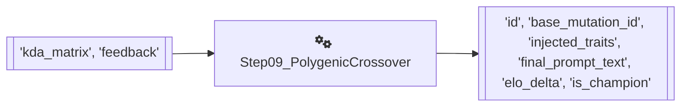
### 📥 Input Payloads to Engine:
```json
{
  "kda_matrix": {
    "generation_num": 0,
    "overall_winner_mutation_id": "mut_gen0_0_ac6a",
    "best_tone_mutation_id": "mut_gen0_2_f42c",
    "best_conciseness_mutation_id": "mut_gen0_0_ac6a",
    "best_accuracy_mutation_id": "mut_gen0_3_9c11",
    "evaluations": [
      {
        "mutation_id": "mut_gen0_0_ac6a",
        "prompt_text": "Generate an email to Lynn recommending Christine McEvoy for the new accounting project testing, which will take up to 50% of the selected individual's time, and request discussion in the next team leader meeting",
        "synthetic_text": "Subject: Recommendation for Accounting Project Testing - Christine McEvoy\nDear Lynn,\nI am writing to highly recommend Christine McEvoy for the new accounting project testing. I believe her skills and expertise would be a great asset to this project. As you know, this project will require a significant time commitment, up to 50% of the selected individual's time. I think Christine would be an excellent fit 
... [truncated for readability]
```
### 📤 Output Payloads from Engine:
```json
{
  "id": "Super_P_Gen_0_2cd2",
  "base_mutation_id": "mut_gen0_0_ac6a",
  "injected_traits": {
    "tone": "mut_gen0_2_f42c",
    "conciseness": "mut_gen0_0_ac6a",
    "accuracy": "mut_gen0_3_9c11"
  },
  "final_prompt_text": "Generate an email to Lynn recommending Christine McEvoy for the new accounting project testing, which will take up to 50% of the selected individual's time, and request discussion in the next team leader meeting, using a casual and conversational tone similar to 'Generate an email to Lynn recommending Christine McEvoy for testing on the new accounting project, which will take up to 50% of their time, and requesting discussion in the next team leader meeting', while maintaining conciseness as in 'Generate an email to Lynn recommending Christine McEvoy for the new accounting project testing, which will take up to 50% of the selected individual's time, and request discussion in the next team leader meeting', and ensuring accuracy like 'Generate an email to Lynn and Rick Dietz recommending Christine McEvoy for the new accounting project testing, which will take up to 50% of her time, and request to discuss this in the next team leader meeting', and avoiding phrases like 'I am writing to highly recommend' and 'I believe her skills and expertise would be a great asset', while including necessary details like mentioning Amy as an alternative option, and using a direct and straightforward tone with a sign-off like 'Thank you'",
  "elo_delta": 3.5,
  "is_champi
... [truncated for readability]
```
---

## 🧩 Step10_Elitism (Generation 0)
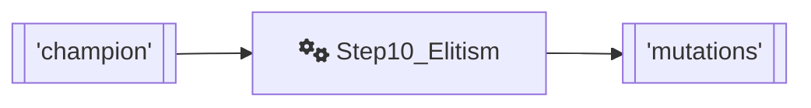
### 📥 Input Payloads to Engine:
```json
{
  "champion": {
    "id": "Super_P_Gen_0_2cd2",
    "base_mutation_id": "mut_gen0_0_ac6a",
    "injected_traits": {
      "tone": "mut_gen0_2_f42c",
      "conciseness": "mut_gen0_0_ac6a",
      "accuracy": "mut_gen0_3_9c11"
    },
    "final_prompt_text": "Generate an email to Lynn recommending Christine McEvoy for the new accounting project testing, which will take up to 50% of the selected individual's time, and request discussion in the next team leader meeting, using a casual and conversational tone similar to 'Generate an email to Lynn recommending Christine McEvoy for testing on the new accounting project, which will take up to 50% of their time, and requesting discussion in the next team leader meeting', while maintaining conciseness as in 'Generate an email to Lynn recommending Christine McEvoy for the new accounting project testing, which will take up to 50% of the selected individual's time, and request discussion in the next team leader meeting', and ensuring accuracy lik
... [truncated for readability]
```
### 📤 Output Payloads from Engine:
```json
{
  "mutations": [
    {
      "id": "mut_gen1_CHAMP_918f",
      "typology_persona": "Reigning Champion (Base)",
      "prompt_text": "Generate an email to Lynn recommending Christine McEvoy for the new accounting project testing, which will take up to 50% of the selected individual's time, and request discussion in the next team leader meeting, using a casual and conversational tone similar to 'Generate an email to Lynn recommending Christine McEvoy for testing on the new accounting project, which will take up to 50% of their time, and requesting discussion in the next team leader meeting', while maintaining conciseness as in 'Generate an email to Lynn recommending Christine McEvoy for the new accounting project testing, which will take up to 50% of the selected individual's time, and request discussion in the next team leader meeting', and ensuring accuracy like 'Generate an email to Lynn and Rick Dietz recommending Christine McEvoy for the new accounting project testing, which will take up to 50% of her time, and request to discuss this in the next team leader meeting', and avoiding phrases like 'I am writing to highly recommend' and 'I believe her skills and expertise would be a great asset', while including necessary details like mentioning Amy as an alternative option, and using a direct and straightforward tone with a sign-off like 'Thank you'",
      "generation_num": 1
    },
    {
      "id": "mut_gen1_CHAL_0_a082",
      "typology_persona": "Challenger Variant",
 
... [truncated for readability]
```
---

## 🧩 Step06_Evaluate (Generation 1)

### 📥 Input Payloads to Engine:
```json
{
  "mutations": [
    {
      "id": "mut_gen1_CHAMP_918f",
      "typology_persona": "Reigning Champion (Base)",
      "prompt_text": "Generate an email to Lynn recommending Christine McEvoy for the new accounting project testing, which will take up to 50% of the selected individual's time, and request discussion in the next team leader meeting, using a casual and conversational tone similar to 'Generate an email to Lynn recommending Christine McEvoy for testing on the new accounting project, which will take up to 50% of their time, and requesting discussion in the next team leader meeting', while maintaining conciseness as in 'Generate an email to Lynn recommending Christine McEvoy for the new accounting project testing, which will take up to 50% of the selected individual's time, and request discussion in the next team leader meeting', and ensuring accuracy like 'Generate an email to Lynn and Rick Dietz recommending Christine McEvoy for the new accounting project testing, which will
... [truncated for readability]
```
### 📤 Output Payloads from Engine:
```json
{
  "evaluations": [
    {
      "mutation_id": "mut_gen1_CHAMP_918f",
      "prompt_text": "Generate an email to Lynn recommending Christine McEvoy for the new accounting project testing, which will take up to 50% of the selected individual's time, and request discussion in the next team leader meeting, using a casual and conversational tone similar to 'Generate an email to Lynn recommending Christine McEvoy for testing on the new accounting project, which will take up to 50% of their time, and requesting discussion in the next team leader meeting', while maintaining conciseness as in 'Generate an email to Lynn recommending Christine McEvoy for the new accounting project testing, which will take up to 50% of the selected individual's time, and request discussion in the next team leader meeting', and ensuring accuracy like 'Generate an email to Lynn and Rick Dietz recommending Christine McEvoy for the new accounting project testing, which will take up to 50% of her time, and request to discuss this in the next team leader meeting', and avoiding phrases like 'I am writing to highly recommend' and 'I believe her skills and expertise would be a great asset', while including necessary details like mentioning Amy as an alternative option, and using a direct and straightforward tone with a sign-off like 'Thank you'",
      "synthetic_text": "Hi Lynn, I wanted to touch base with you regarding the new accounting project testing. I think Christine McEvoy would be a great fit, given he
... [truncated for readability]
```
---

## 🧩 Step07_KDARanking (Generation 1)

### 📥 Input Payloads to Engine:
```json
{
  "evaluations": [
    {
      "mutation_id": "mut_gen1_CHAMP_918f",
      "prompt_text": "Generate an email to Lynn recommending Christine McEvoy for the new accounting project testing, which will take up to 50% of the selected individual's time, and request discussion in the next team leader meeting, using a casual and conversational tone similar to 'Generate an email to Lynn recommending Christine McEvoy for testing on the new accounting project, which will take up to 50% of their time, and requesting discussion in the next team leader meeting', while maintaining conciseness as in 'Generate an email to Lynn recommending Christine McEvoy for the new accounting project testing, which will take up to 50% of the selected individual's time, and request discussion in the next team leader meeting', and ensuring accuracy like 'Generate an email to Lynn and Rick Dietz recommending Christine McEvoy for the new accounting project testing, which will take up to 50% of her time, and request to
... [truncated for readability]
```
### 📤 Output Payloads from Engine:
```json
{
  "generation_num": 1,
  "overall_winner_mutation_id": "mut_gen1_CHAMP_918f",
  "best_tone_mutation_id": "mut_gen1_CHAMP_918f",
  "best_conciseness_mutation_id": "mut_gen1_CHAMP_918f",
  "best_accuracy_mutation_id": "mut_gen1_CHAL_0_a082",
  "evaluations": [
    {
      "mutation_id": "mut_gen1_CHAMP_918f",
      "prompt_text": "Generate an email to Lynn recommending Christine McEvoy for the new accounting project testing, which will take up to 50% of the selected individual's time, and request discussion in the next team leader meeting, using a casual and conversational tone similar to 'Generate an email to Lynn recommending Christine McEvoy for testing on the new accounting project, which will take up to 50% of their time, and requesting discussion in the next team leader meeting', while maintaining conciseness as in 'Generate an email to Lynn recommending Christine McEvoy for the new accounting project testing, which will take up to 50% of the selected individual's time, and request discussion in the next team leader meeting', and ensuring accuracy like 'Generate an email to Lynn and Rick Dietz recommending Christine McEvoy for the new accounting project testing, which will take up to 50% of her time, and request to discuss this in the next team leader meeting', and avoiding phrases like 'I am writing to highly recommend' and 'I believe her skills and expertise would be a great asset', while including necessary details like mentioning Amy as an alternative option, and us
... [truncated for readability]
```
---

## 🧩 Step08_FeedbackLoop (Generation 1)

### 📥 Input Payloads to Engine:
```json
{
  "kda_matrix": {
    "generation_num": 1,
    "overall_winner_mutation_id": "mut_gen1_CHAMP_918f",
    "best_tone_mutation_id": "mut_gen1_CHAMP_918f",
    "best_conciseness_mutation_id": "mut_gen1_CHAMP_918f",
    "best_accuracy_mutation_id": "mut_gen1_CHAL_0_a082",
    "evaluations": [
      {
        "mutation_id": "mut_gen1_CHAMP_918f",
        "prompt_text": "Generate an email to Lynn recommending Christine McEvoy for the new accounting project testing, which will take up to 50% of the selected individual's time, and request discussion in the next team leader meeting, using a casual and conversational tone similar to 'Generate an email to Lynn recommending Christine McEvoy for testing on the new accounting project, which will take up to 50% of their time, and requesting discussion in the next team leader meeting', while maintaining conciseness as in 'Generate an email to Lynn recommending Christine McEvoy for the new accounting project testing, which will take up to 50% of the s
... [truncated for readability]
```
### 📤 Output Payloads from Engine:
```json
{
  "kda_matrix_id": "kda_gen_1",
  "feedback_text": "The Synthetic Email failed to achieve a perfect 0.0 Delta due to several reasons. Firstly, the tone is more casual and less formal than the Original Email, which may not be suitable for a professional setting. The Synthetic Email uses phrases like 'Hi Lynn' and 'touch base', which are more informal than the Original Email's 'Lynn,'. Additionally, the Synthetic Email mentions Amy as an alternative, which was not present in the Original Email and may introduce unnecessary information. In terms of conciseness, the Synthetic Email is slightly more verbose than the Original Email, with phrases like 'given her experience and skills in accounting' that could be omitted for brevity. Finally, the Synthetic Email has a slight deviation in factual accuracy, as it mentions 'discuss this further' which is not present in the Original Email. Overall, the Synthetic Email has a more conversational tone and includes some extra information that is not present in the Original Email, resulting in an error delta of 4.50."
}
```
---

## 🧩 Step09_PolygenicCrossover (Generation 1)

### 📥 Input Payloads to Engine:
```json
{
  "kda_matrix": {
    "generation_num": 1,
    "overall_winner_mutation_id": "mut_gen1_CHAMP_918f",
    "best_tone_mutation_id": "mut_gen1_CHAMP_918f",
    "best_conciseness_mutation_id": "mut_gen1_CHAMP_918f",
    "best_accuracy_mutation_id": "mut_gen1_CHAL_0_a082",
    "evaluations": [
      {
        "mutation_id": "mut_gen1_CHAMP_918f",
        "prompt_text": "Generate an email to Lynn recommending Christine McEvoy for the new accounting project testing, which will take up to 50% of the selected individual's time, and request discussion in the next team leader meeting, using a casual and conversational tone similar to 'Generate an email to Lynn recommending Christine McEvoy for testing on the new accounting project, which will take up to 50% of their time, and requesting discussion in the next team leader meeting', while maintaining conciseness as in 'Generate an email to Lynn recommending Christine McEvoy for the new accounting project testing, which will take up to 50% of the s
... [truncated for readability]
```
### 📤 Output Payloads from Engine:
```json
{
  "id": "Super_P_Gen_1_4ef8",
  "base_mutation_id": "mut_gen1_CHAMP_918f",
  "injected_traits": {
    "tone": "mut_gen1_CHAMP_918f",
    "conciseness": "mut_gen1_CHAMP_918f",
    "accuracy": "mut_gen1_CHAL_0_a082"
  },
  "final_prompt_text": "Generate an email to Lynn recommending Christine McEvoy for the new accounting project testing, which will take up to 50% of their time, and request discussion in the next team leader meeting, using a direct and straightforward tone, while maintaining conciseness and ensuring accuracy, and avoiding informal phrases, with a sign-off like 'Thank you'",
  "elo_delta": 4.5,
  "is_champion": true
}
```
---

## 🧩 Step10_Elitism (Generation 1)

### 📥 Input Payloads to Engine:
```json
{
  "champion": {
    "id": "Super_P_Gen_1_4ef8",
    "base_mutation_id": "mut_gen1_CHAMP_918f",
    "injected_traits": {
      "tone": "mut_gen1_CHAMP_918f",
      "conciseness": "mut_gen1_CHAMP_918f",
      "accuracy": "mut_gen1_CHAL_0_a082"
    },
    "final_prompt_text": "Generate an email to Lynn recommending Christine McEvoy for the new accounting project testing, which will take up to 50% of their time, and request discussion in the next team leader meeting, using a direct and straightforward tone, while maintaining conciseness and ensuring accuracy, and avoiding informal phrases, with a sign-off like 'Thank you'",
    "elo_delta": 4.5,
    "is_champion": true
  }
}
```
### 📤 Output Payloads from Engine:
```json
{
  "mutations": [
    {
      "id": "mut_gen2_CHAMP_20f2",
      "typology_persona": "Reigning Champion (Base)",
      "prompt_text": "Generate an email to Lynn recommending Christine McEvoy for the new accounting project testing, which will take up to 50% of their time, and request discussion in the next team leader meeting, using a direct and straightforward tone, while maintaining conciseness and ensuring accuracy, and avoiding informal phrases, with a sign-off like 'Thank you'",
      "generation_num": 2
    },
    {
      "id": "mut_gen2_CHAL_0_eccc",
      "typology_persona": "Challenger Variant",
      "prompt_text": "Generate an email to Lynn recommending Christine McEvoy for the new accounting project, which will require up to 50% of their time, and request a discussion at the next team leader meeting, using a concise and direct tone while ensuring accuracy and avoiding informal language, and end with a 'Thank you' sign-off",
      "generation_num": 2
    },
    {
      "id": "mut_gen2_CHAL_1_4d6f",
      "typology_persona": "Challenger Variant",
      "prompt_text": "Create an email to Lynn suggesting Christine McEvoy for the accounting project test, which will occupy up to 50% of their time, and ask for a meeting discussion, using straightforward language and a professional tone, while being brief and precise, and closing with 'Thank you'",
      "generation_num": 2
    },
    {
      "id": "mut_gen2_CHAL_2_4a34",
      "typology_persona": "Challenger Variant",
  
... [truncated for readability]
```
---

## 🧩 Step06_Evaluate (Generation 2)

### 📥 Input Payloads to Engine:
```json
{
  "mutations": [
    {
      "id": "mut_gen2_CHAMP_20f2",
      "typology_persona": "Reigning Champion (Base)",
      "prompt_text": "Generate an email to Lynn recommending Christine McEvoy for the new accounting project testing, which will take up to 50% of their time, and request discussion in the next team leader meeting, using a direct and straightforward tone, while maintaining conciseness and ensuring accuracy, and avoiding informal phrases, with a sign-off like 'Thank you'",
      "generation_num": 2
    },
    {
      "id": "mut_gen2_CHAL_0_eccc",
      "typology_persona": "Challenger Variant",
      "prompt_text": "Generate an email to Lynn recommending Christine McEvoy for the new accounting project, which will require up to 50% of their time, and request a discussion at the next team leader meeting, using a concise and direct tone while ensuring accuracy and avoiding informal language, and end with a 'Thank you' sign-off",
      "generation_num": 2
    },
    {
      "id":
... [truncated for readability]
```
### 📤 Output Payloads from Engine:
```json
{
  "evaluations": [
    {
      "mutation_id": "mut_gen2_CHAMP_20f2",
      "prompt_text": "Generate an email to Lynn recommending Christine McEvoy for the new accounting project testing, which will take up to 50% of their time, and request discussion in the next team leader meeting, using a direct and straightforward tone, while maintaining conciseness and ensuring accuracy, and avoiding informal phrases, with a sign-off like 'Thank you'",
      "synthetic_text": "Subject: Recommendation for Accounting Project Testing\nDear Lynn,\nI am writing to recommend Christine McEvoy for the new accounting project testing, which is expected to require up to 50% of their time. I believe Christine's skills and experience make her an ideal candidate for this project. I would like to discuss this further in our next team leader meeting and explore how we can move forward with this project. Thank you",
      "tone_score": 8.5,
      "conciseness_score": 9.0,
      "accuracy_score": 8.0,
      "tone_delta": 1.5,
      "conciseness_delta": 1.5,
      "accuracy_delta": 1.0,
      "persona_deviation_penalty": 0.0,
      "overall_delta": 4.0
    },
    {
      "mutation_id": "mut_gen2_CHAL_0_eccc",
      "prompt_text": "Generate an email to Lynn recommending Christine McEvoy for the new accounting project, which will require up to 50% of their time, and request a discussion at the next team leader meeting, using a concise and direct tone while ensuring accuracy and avoiding informal language, a
... [truncated for readability]
```
---

## 🧩 Step07_KDARanking (Generation 2)

### 📥 Input Payloads to Engine:
```json
{
  "evaluations": [
    {
      "mutation_id": "mut_gen2_CHAMP_20f2",
      "prompt_text": "Generate an email to Lynn recommending Christine McEvoy for the new accounting project testing, which will take up to 50% of their time, and request discussion in the next team leader meeting, using a direct and straightforward tone, while maintaining conciseness and ensuring accuracy, and avoiding informal phrases, with a sign-off like 'Thank you'",
      "synthetic_text": "Subject: Recommendation for Accounting Project Testing\nDear Lynn,\nI am writing to recommend Christine McEvoy for the new accounting project testing, which is expected to require up to 50% of their time. I believe Christine's skills and experience make her an ideal candidate for this project. I would like to discuss this further in our next team leader meeting and explore how we can move forward with this project. Thank you",
      "tone_score": 8.5,
      "conciseness_score": 9.0,
      "accuracy_score": 8.0,
      "tone_
... [truncated for readability]
```
### 📤 Output Payloads from Engine:
```json
{
  "generation_num": 2,
  "overall_winner_mutation_id": "mut_gen2_CHAMP_20f2",
  "best_tone_mutation_id": "mut_gen2_CHAMP_20f2",
  "best_conciseness_mutation_id": "mut_gen2_CHAMP_20f2",
  "best_accuracy_mutation_id": "mut_gen2_CHAMP_20f2",
  "evaluations": [
    {
      "mutation_id": "mut_gen2_CHAMP_20f2",
      "prompt_text": "Generate an email to Lynn recommending Christine McEvoy for the new accounting project testing, which will take up to 50% of their time, and request discussion in the next team leader meeting, using a direct and straightforward tone, while maintaining conciseness and ensuring accuracy, and avoiding informal phrases, with a sign-off like 'Thank you'",
      "synthetic_text": "Subject: Recommendation for Accounting Project Testing\nDear Lynn,\nI am writing to recommend Christine McEvoy for the new accounting project testing, which is expected to require up to 50% of their time. I believe Christine's skills and experience make her an ideal candidate for this project. I would like to discuss this further in our next team leader meeting and explore how we can move forward with this project. Thank you",
      "tone_score": 8.5,
      "conciseness_score": 9.0,
      "accuracy_score": 8.0,
      "tone_delta": 1.5,
      "conciseness_delta": 1.5,
      "accuracy_delta": 1.0,
      "persona_deviation_penalty": 0.0,
      "overall_delta": 4.0
    },
    {
      "mutation_id": "mut_gen2_CHAL_0_eccc",
      "prompt_text": "Generate an email to Lynn recommending C
... [truncated for readability]
```
---

## 🧩 Step08_FeedbackLoop (Generation 2)

### 📥 Input Payloads to Engine:
```json
{
  "kda_matrix": {
    "generation_num": 2,
    "overall_winner_mutation_id": "mut_gen2_CHAMP_20f2",
    "best_tone_mutation_id": "mut_gen2_CHAMP_20f2",
    "best_conciseness_mutation_id": "mut_gen2_CHAMP_20f2",
    "best_accuracy_mutation_id": "mut_gen2_CHAMP_20f2",
    "evaluations": [
      {
        "mutation_id": "mut_gen2_CHAMP_20f2",
        "prompt_text": "Generate an email to Lynn recommending Christine McEvoy for the new accounting project testing, which will take up to 50% of their time, and request discussion in the next team leader meeting, using a direct and straightforward tone, while maintaining conciseness and ensuring accuracy, and avoiding informal phrases, with a sign-off like 'Thank you'",
        "synthetic_text": "Subject: Recommendation for Accounting Project Testing\nDear Lynn,\nI am writing to recommend Christine McEvoy for the new accounting project testing, which is expected to require up to 50% of their time. I believe Christine's skills and experience mak
... [truncated for readability]
```
### 📤 Output Payloads from Engine:
```json
{
  "kda_matrix_id": "kda_gen_2",
  "feedback_text": "The Synthetic Email failed to achieve a perfect 0.0 Delta due to several reasons. Firstly, the tone of the Synthetic Email is more formal and polished than the Original Email, which has a more casual and conversational tone. The Synthetic Email uses phrases like 'I am writing to recommend' and 'I believe Christine's skills and experience make her an ideal candidate', which are not present in the Original Email. The tone of the Synthetic Email comes across as more generic and lacks the personal touch of the Original Email. Secondly, the Synthetic Email is less concise than the Original Email. It uses more words to convey the same message, which makes it feel more verbose. For example, the Synthetic Email uses the phrase 'which is expected to require up to 50% of their time' to convey the same information that the Original Email conveys with the phrase 'Which will take up to 50% of their time away from the team'. Lastly, the Synthetic Email lacks some of the factual accuracy of the Original Email. The Original Email mentions that the recommendation was made to both Lynn and Rick Dietz, which is not mentioned in the Synthetic Email. Additionally, the Original Email includes a specific request to discuss the matter in the next team leader meeting 'for all the individuals involved in this testing', which is not present in the Synthetic Email. Overall, while the Synthetic Email is well-written, it lacks the tone, conciseness, an
... [truncated for readability]
```
---

## 🧩 Step09_PolygenicCrossover (Generation 2)

### 📥 Input Payloads to Engine:
```json
{
  "kda_matrix": {
    "generation_num": 2,
    "overall_winner_mutation_id": "mut_gen2_CHAMP_20f2",
    "best_tone_mutation_id": "mut_gen2_CHAMP_20f2",
    "best_conciseness_mutation_id": "mut_gen2_CHAMP_20f2",
    "best_accuracy_mutation_id": "mut_gen2_CHAMP_20f2",
    "evaluations": [
      {
        "mutation_id": "mut_gen2_CHAMP_20f2",
        "prompt_text": "Generate an email to Lynn recommending Christine McEvoy for the new accounting project testing, which will take up to 50% of their time, and request discussion in the next team leader meeting, using a direct and straightforward tone, while maintaining conciseness and ensuring accuracy, and avoiding informal phrases, with a sign-off like 'Thank you'",
        "synthetic_text": "Subject: Recommendation for Accounting Project Testing\nDear Lynn,\nI am writing to recommend Christine McEvoy for the new accounting project testing, which is expected to require up to 50% of their time. I believe Christine's skills and experience mak
... [truncated for readability]
```
### 📤 Output Payloads from Engine:
```json
{
  "id": "Super_P_Gen_2_dc3c",
  "base_mutation_id": "mut_gen2_CHAMP_20f2",
  "injected_traits": {
    "tone": "mut_gen2_CHAMP_20f2",
    "conciseness": "mut_gen2_CHAMP_20f2",
    "accuracy": "mut_gen2_CHAMP_20f2"
  },
  "final_prompt_text": "Generate an email to Lynn and Rick Dietz recommending Christine McEvoy for the new accounting project testing, which will take up to 50% of their time away from the team, and request discussion in the next team leader meeting for all the individuals involved in this testing, using a direct and conversational tone, while maintaining factual accuracy and conciseness, and avoiding generic phrases, with a sign-off like 'Thank you'",
  "elo_delta": 4.0,
  "is_champion": true
}
```
---

## 🧩 Step10_Elitism (Generation 2)
```mermaid
graph LR
    Inputs[['champion']] --> Engine[fa:fa-cogs Step10_Elitism]
    Engine --> Outputs[['mutations']]
```
### 📥 Input Payloads to Engine:
```json
{
  "champion": {
    "id": "Super_P_Gen_2_dc3c",
    "base_mutation_id": "mut_gen2_CHAMP_20f2",
    "injected_traits": {
      "tone": "mut_gen2_CHAMP_20f2",
      "conciseness": "mut_gen2_CHAMP_20f2",
      "accuracy": "mut_gen2_CHAMP_20f2"
    },
    "final_prompt_text": "Generate an email to Lynn and Rick Dietz recommending Christine McEvoy for the new accounting project testing, which will take up to 50% of their time away from the team, and request discussion in the next team leader meeting for all the individuals involved in this testing, using a direct and conversational tone, while maintaining factual accuracy and conciseness, and avoiding generic phrases, with a sign-off like 'Thank you'",
    "elo_delta": 4.0,
    "is_champion": true
  }
}
```
### 📤 Output Payloads from Engine:
```json
{
  "mutations": [
    {
      "id": "mut_gen3_CHAMP_d1b9",
      "typology_persona": "Reigning Champion (Base)",
      "prompt_text": "Generate an email to Lynn and Rick Dietz recommending Christine McEvoy for the new accounting project testing, which will take up to 50% of their time away from the team, and request discussion in the next team leader meeting for all the individuals involved in this testing, using a direct and conversational tone, while maintaining factual accuracy and conciseness, and avoiding generic phrases, with a sign-off like 'Thank you'",
      "generation_num": 3
    },
    {
      "id": "mut_gen3_CHAL_0_b845",
      "typology_persona": "Challenger Variant",
      "prompt_text": "Generate an email to Lynn and Rick Dietz recommending Christine McEvoy for the new accounting project testing, which will require up to 50% of their time, and request a team leader meeting discussion with all involved individuals, using a direct and conversational tone while maintaining factual accuracy and conciseness, and avoiding generic phrases, with a sign-off like 'Thank you'",
      "generation_num": 3
    },
    {
      "id": "mut_gen3_CHAL_1_feaf",
      "typology_persona": "Challenger Variant",
      "prompt_text": "Create an email to Lynn and Rick Dietz suggesting Christine McEvoy for the accounting project testing, which will take up to 50% of their time, and ask for a discussion in the next team leader meeting with all testing participants, using a direct and con
... [truncated for readability]
```
---

## 🧩 Step06_Evaluate (Generation 3)
```mermaid
graph LR
    Inputs[['mutations']] --> Engine[fa:fa-cogs Step06_Evaluate]
    Engine --> Outputs[['evaluations']]
```
### 📥 Input Payloads to Engine:
```json
{
  "mutations": [
    {
      "id": "mut_gen3_CHAMP_d1b9",
      "typology_persona": "Reigning Champion (Base)",
      "prompt_text": "Generate an email to Lynn and Rick Dietz recommending Christine McEvoy for the new accounting project testing, which will take up to 50% of their time away from the team, and request discussion in the next team leader meeting for all the individuals involved in this testing, using a direct and conversational tone, while maintaining factual accuracy and conciseness, and avoiding generic phrases, with a sign-off like 'Thank you'",
      "generation_num": 3
    },
    {
      "id": "mut_gen3_CHAL_0_b845",
      "typology_persona": "Challenger Variant",
      "prompt_text": "Generate an email to Lynn and Rick Dietz recommending Christine McEvoy for the new accounting project testing, which will require up to 50% of their time, and request a team leader meeting discussion with all involved individuals, using a direct and conversational tone while maintainin
... [truncated for readability]
```
### 📤 Output Payloads from Engine:
```json
{
  "evaluations": [
    {
      "mutation_id": "mut_gen3_CHAMP_d1b9",
      "prompt_text": "Generate an email to Lynn and Rick Dietz recommending Christine McEvoy for the new accounting project testing, which will take up to 50% of their time away from the team, and request discussion in the next team leader meeting for all the individuals involved in this testing, using a direct and conversational tone, while maintaining factual accuracy and conciseness, and avoiding generic phrases, with a sign-off like 'Thank you'",
      "synthetic_text": "Subject: Recommendation for Accounting Project Testing - Christine McEvoy Hi Lynn and Rick, I wanted to touch base with you regarding the new accounting project testing that's about to kick off. I highly recommend Christine McEvoy for this project, given her exceptional skills and experience in accounting. Please note that this project will require up to 50% of the team's time, so it's essential we discuss the details and make necessary arrangements. I'd like to request that we add this topic to the agenda for our next team leader meeting, ensuring all individuals involved are present. This will give us a chance to align on expectations and make a plan for the project's success. Thank you",
      "tone_score": 9.5,
      "conciseness_score": 9.0,
      "accuracy_score": 8.5,
      "tone_delta": 2.5,
      "conciseness_delta": 1.5,
      "accuracy_delta": 0.5,
      "persona_deviation_penalty": 0.0,
      "overall_delta": 4.5
    },
   
... [truncated for readability]
```
---

## 🧩 Step07_KDARanking (Generation 3)
```mermaid
graph LR
    Inputs[['evaluations']] --> Engine[fa:fa-cogs Step07_KDARanking]
    Engine --> Outputs[['generation_num', 'overall_winner_mutation_id', 'best_tone_mutation_id', 'best_conciseness_mutation_id', 'best_accuracy_mutation_id', 'evaluations']]
```
### 📥 Input Payloads to Engine:
```json
{
  "evaluations": [
    {
      "mutation_id": "mut_gen3_CHAMP_d1b9",
      "prompt_text": "Generate an email to Lynn and Rick Dietz recommending Christine McEvoy for the new accounting project testing, which will take up to 50% of their time away from the team, and request discussion in the next team leader meeting for all the individuals involved in this testing, using a direct and conversational tone, while maintaining factual accuracy and conciseness, and avoiding generic phrases, with a sign-off like 'Thank you'",
      "synthetic_text": "Subject: Recommendation for Accounting Project Testing - Christine McEvoy Hi Lynn and Rick, I wanted to touch base with you regarding the new accounting project testing that's about to kick off. I highly recommend Christine McEvoy for this project, given her exceptional skills and experience in accounting. Please note that this project will require up to 50% of the team's time, so it's essential we discuss the details and make necessary arrangem
... [truncated for readability]
```
### 📤 Output Payloads from Engine:
```json
{
  "generation_num": 3,
  "overall_winner_mutation_id": "mut_gen3_CHAL_1_feaf",
  "best_tone_mutation_id": "mut_gen3_CHAL_1_feaf",
  "best_conciseness_mutation_id": "mut_gen3_CHAL_1_feaf",
  "best_accuracy_mutation_id": "mut_gen3_CHAMP_d1b9",
  "evaluations": [
    {
      "mutation_id": "mut_gen3_CHAL_1_feaf",
      "prompt_text": "Create an email to Lynn and Rick Dietz suggesting Christine McEvoy for the accounting project testing, which will take up to 50% of their time, and ask for a discussion in the next team leader meeting with all testing participants, using a direct and conversational tone while keeping the message concise and factually accurate, and avoiding clich\u00e9s, with a closing like 'Thank you'",
      "synthetic_text": "Subject: Accounting Project Testing - Christine McEvoy Recommendation\nDear Lynn and Rick Dietz,\nI am writing to suggest Christine McEvoy for the upcoming accounting project testing, which is expected to take up to 50% of your time. I believe Christine's skills and experience make her a strong fit for this project. I would like to discuss this further with you and all testing participants in our next team leader meeting. Please let me know your availability. Thank you",
      "tone_score": 8.5,
      "conciseness_score": 9.0,
      "accuracy_score": 8.0,
      "tone_delta": 1.5,
      "conciseness_delta": 1.5,
      "accuracy_delta": 1.0,
      "persona_deviation_penalty": 0.0,
      "overall_delta": 4.0
    },
    {
      "mutation_id": 
... [truncated for readability]
```
---

## 🧩 Step08_FeedbackLoop (Generation 3)
```mermaid
graph LR
    Inputs[['kda_matrix']] --> Engine[fa:fa-cogs Step08_FeedbackLoop]
    Engine --> Outputs[['kda_matrix_id', 'feedback_text']]
```
### 📥 Input Payloads to Engine:
```json
{
  "kda_matrix": {
    "generation_num": 3,
    "overall_winner_mutation_id": "mut_gen3_CHAL_1_feaf",
    "best_tone_mutation_id": "mut_gen3_CHAL_1_feaf",
    "best_conciseness_mutation_id": "mut_gen3_CHAL_1_feaf",
    "best_accuracy_mutation_id": "mut_gen3_CHAMP_d1b9",
    "evaluations": [
      {
        "mutation_id": "mut_gen3_CHAL_1_feaf",
        "prompt_text": "Create an email to Lynn and Rick Dietz suggesting Christine McEvoy for the accounting project testing, which will take up to 50% of their time, and ask for a discussion in the next team leader meeting with all testing participants, using a direct and conversational tone while keeping the message concise and factually accurate, and avoiding clich\u00e9s, with a closing like 'Thank you'",
        "synthetic_text": "Subject: Accounting Project Testing - Christine McEvoy Recommendation\nDear Lynn and Rick Dietz,\nI am writing to suggest Christine McEvoy for the upcoming accounting project testing, which is expected to take u
... [truncated for readability]
```
### 📤 Output Payloads from Engine:
```json
{
  "kda_matrix_id": "kda_gen_3",
  "feedback_text": "The Synthetic Email failed to achieve a perfect 0.0 Delta due to several reasons. Firstly, the tone is slightly more formal and polished than the Original Email, which had a more personal and conversational tone. The Synthetic Email's greeting, 'Dear Lynn and Rick Dietz,' is more formal than the Original Email's 'Lynn.' Additionally, the language used in the Synthetic Email is more refined, which, although professional, deviates from the Original Email's tone. In terms of conciseness, the Synthetic Email is more direct and to the point, but it also omits some details, such as the fact that the recommendation was made to both Lynn and Rick Dietz, and that the testing will take up to 50% of the selected individual's time away from the team, not 'your time' as stated in the Synthetic Email. Regarding factual accuracy, the Synthetic Email is mostly accurate but contains a critical error in the sentence 'which is expected to take up to 50% of your time.' The Original Email clearly states that the testing will take up to 50% of the selected individual's time away from the team, not the time of the people being addressed in the email. Furthermore, the Synthetic Email mentions discussing the matter with 'all testing participants,' which is not explicitly mentioned in the Original Email. The call to action in the Synthetic Email, 'Please let me know your availability,' is also not present in the Original Email and seems out of plac
... [truncated for readability]
```
---

## 🧩 Step09_PolygenicCrossover (Generation 3)
```mermaid
graph LR
    Inputs[['kda_matrix', 'feedback']] --> Engine[fa:fa-cogs Step09_PolygenicCrossover]
    Engine --> Outputs[['id', 'base_mutation_id', 'injected_traits', 'final_prompt_text', 'elo_delta', 'is_champion']]
```
### 📥 Input Payloads to Engine:
```json
{
  "kda_matrix": {
    "generation_num": 3,
    "overall_winner_mutation_id": "mut_gen3_CHAL_1_feaf",
    "best_tone_mutation_id": "mut_gen3_CHAL_1_feaf",
    "best_conciseness_mutation_id": "mut_gen3_CHAL_1_feaf",
    "best_accuracy_mutation_id": "mut_gen3_CHAMP_d1b9",
    "evaluations": [
      {
        "mutation_id": "mut_gen3_CHAL_1_feaf",
        "prompt_text": "Create an email to Lynn and Rick Dietz suggesting Christine McEvoy for the accounting project testing, which will take up to 50% of their time, and ask for a discussion in the next team leader meeting with all testing participants, using a direct and conversational tone while keeping the message concise and factually accurate, and avoiding clich\u00e9s, with a closing like 'Thank you'",
        "synthetic_text": "Subject: Accounting Project Testing - Christine McEvoy Recommendation\nDear Lynn and Rick Dietz,\nI am writing to suggest Christine McEvoy for the upcoming accounting project testing, which is expected to take u
... [truncated for readability]
```
### 📤 Output Payloads from Engine:
```json
{
  "id": "Super_P_Gen_3_fc00",
  "base_mutation_id": "mut_gen3_CHAL_1_feaf",
  "injected_traits": {
    "tone": "mut_gen3_CHAL_1_feaf",
    "conciseness": "mut_gen3_CHAL_1_feaf",
    "accuracy": "mut_gen3_CHAMP_d1b9"
  },
  "final_prompt_text": "Create an email to Lynn and Rick Dietz suggesting Christine McEvoy for the accounting project testing, which will take up to 50% of the selected individual's time away from the team, and ask for a discussion in the next team leader meeting with all individuals involved in this testing, using a direct, personal, and conversational tone, while maintaining factual accuracy, conciseness, and avoiding clich\u00e9s and generic phrases, with a closing like 'Thank you'",
  "elo_delta": 4.0,
  "is_champion": true
}
```
---

## 🧩 Step10_Elitism (Generation 3)
```mermaid
graph LR
    Inputs[['champion']] --> Engine[fa:fa-cogs Step10_Elitism]
    Engine --> Outputs[['mutations']]
```
### 📥 Input Payloads to Engine:
```json
{
  "champion": {
    "id": "Super_P_Gen_3_fc00",
    "base_mutation_id": "mut_gen3_CHAL_1_feaf",
    "injected_traits": {
      "tone": "mut_gen3_CHAL_1_feaf",
      "conciseness": "mut_gen3_CHAL_1_feaf",
      "accuracy": "mut_gen3_CHAMP_d1b9"
    },
    "final_prompt_text": "Create an email to Lynn and Rick Dietz suggesting Christine McEvoy for the accounting project testing, which will take up to 50% of the selected individual's time away from the team, and ask for a discussion in the next team leader meeting with all individuals involved in this testing, using a direct, personal, and conversational tone, while maintaining factual accuracy, conciseness, and avoiding clich\u00e9s and generic phrases, with a closing like 'Thank you'",
    "elo_delta": 4.0,
    "is_champion": true
  }
}
```
### 📤 Output Payloads from Engine:
```json
{
  "mutations": [
    {
      "id": "mut_gen4_CHAMP_afc1",
      "typology_persona": "Reigning Champion (Base)",
      "prompt_text": "Create an email to Lynn and Rick Dietz suggesting Christine McEvoy for the accounting project testing, which will take up to 50% of the selected individual's time away from the team, and ask for a discussion in the next team leader meeting with all individuals involved in this testing, using a direct, personal, and conversational tone, while maintaining factual accuracy, conciseness, and avoiding clich\u00e9s and generic phrases, with a closing like 'Thank you'",
      "generation_num": 4
    },
    {
      "id": "mut_gen4_CHAL_0_14e3",
      "typology_persona": "Challenger Variant",
      "prompt_text": "Create an email to Lynn and Rick Dietz suggesting Christine McEvoy for the accounting project testing, which will require up to 50% of the selected individual's time, and request a discussion with all involved team leaders in the next meeting, using a direct and conversational tone, while maintaining factual accuracy and conciseness, and avoiding clich\u00e9s, closing with 'Thank you'",
      "generation_num": 4
    },
    {
      "id": "mut_gen4_CHAL_1_e57c",
      "typology_persona": "Challenger Variant",
      "prompt_text": "Email Lynn and Rick Dietz to propose Christine McEvoy for the accounting project testing, which will occupy up to 50% of the chosen individual's time, and ask for a meeting discussion with involved team leaders, usin
... [truncated for readability]
```
---

## 🧩 Step06_Evaluate (Generation 4)
```mermaid
graph LR
    Inputs[['mutations']] --> Engine[fa:fa-cogs Step06_Evaluate]
    Engine --> Outputs[['evaluations']]
```
### 📥 Input Payloads to Engine:
```json
{
  "mutations": [
    {
      "id": "mut_gen4_CHAMP_afc1",
      "typology_persona": "Reigning Champion (Base)",
      "prompt_text": "Create an email to Lynn and Rick Dietz suggesting Christine McEvoy for the accounting project testing, which will take up to 50% of the selected individual's time away from the team, and ask for a discussion in the next team leader meeting with all individuals involved in this testing, using a direct, personal, and conversational tone, while maintaining factual accuracy, conciseness, and avoiding clich\u00e9s and generic phrases, with a closing like 'Thank you'",
      "generation_num": 4
    },
    {
      "id": "mut_gen4_CHAL_0_14e3",
      "typology_persona": "Challenger Variant",
      "prompt_text": "Create an email to Lynn and Rick Dietz suggesting Christine McEvoy for the accounting project testing, which will require up to 50% of the selected individual's time, and request a discussion with all involved team leaders in the next meeting, using a
... [truncated for readability]
```
### 📤 Output Payloads from Engine:
```json
{
  "evaluations": [
    {
      "mutation_id": "mut_gen4_CHAMP_afc1",
      "prompt_text": "Create an email to Lynn and Rick Dietz suggesting Christine McEvoy for the accounting project testing, which will take up to 50% of the selected individual's time away from the team, and ask for a discussion in the next team leader meeting with all individuals involved in this testing, using a direct, personal, and conversational tone, while maintaining factual accuracy, conciseness, and avoiding clich\u00e9s and generic phrases, with a closing like 'Thank you'",
      "synthetic_text": "Subject: Recommendation for Accounting Project Testing - Christine McEvoy Hi Lynn and Rick, I wanted to touch base with you regarding the upcoming accounting project testing. After careful consideration, I would like to suggest Christine McEvoy for this role. As you know, this project will require a significant time commitment, potentially taking up to 50% of the selected individual's time away from the team. I believe Christine has the necessary skills and expertise to excel in this testing. I think it would be beneficial to discuss this further in our next team leader meeting, with all individuals involved in the testing present. This will give us an opportunity to address any questions or concerns and ensure everyone is on the same page. Thank you",
      "tone_score": 9.0,
      "conciseness_score": 7.0,
      "accuracy_score": 8.0,
      "tone_delta": 2.0,
      "conciseness_delta": 0.5,
      "a
... [truncated for readability]
```
---

## 🧩 Step07_KDARanking (Generation 4)
```mermaid
graph LR
    Inputs[['evaluations']] --> Engine[fa:fa-cogs Step07_KDARanking]
    Engine --> Outputs[['generation_num', 'overall_winner_mutation_id', 'best_tone_mutation_id', 'best_conciseness_mutation_id', 'best_accuracy_mutation_id', 'evaluations']]
```
### 📥 Input Payloads to Engine:
```json
{
  "evaluations": [
    {
      "mutation_id": "mut_gen4_CHAMP_afc1",
      "prompt_text": "Create an email to Lynn and Rick Dietz suggesting Christine McEvoy for the accounting project testing, which will take up to 50% of the selected individual's time away from the team, and ask for a discussion in the next team leader meeting with all individuals involved in this testing, using a direct, personal, and conversational tone, while maintaining factual accuracy, conciseness, and avoiding clich\u00e9s and generic phrases, with a closing like 'Thank you'",
      "synthetic_text": "Subject: Recommendation for Accounting Project Testing - Christine McEvoy Hi Lynn and Rick, I wanted to touch base with you regarding the upcoming accounting project testing. After careful consideration, I would like to suggest Christine McEvoy for this role. As you know, this project will require a significant time commitment, potentially taking up to 50% of the selected individual's time away from the team. I
... [truncated for readability]
```
### 📤 Output Payloads from Engine:
```json
{
  "generation_num": 4,
  "overall_winner_mutation_id": "mut_gen4_CHAMP_afc1",
  "best_tone_mutation_id": "mut_gen4_CHAMP_afc1",
  "best_conciseness_mutation_id": "mut_gen4_CHAMP_afc1",
  "best_accuracy_mutation_id": "mut_gen4_CHAL_1_e57c",
  "evaluations": [
    {
      "mutation_id": "mut_gen4_CHAMP_afc1",
      "prompt_text": "Create an email to Lynn and Rick Dietz suggesting Christine McEvoy for the accounting project testing, which will take up to 50% of the selected individual's time away from the team, and ask for a discussion in the next team leader meeting with all individuals involved in this testing, using a direct, personal, and conversational tone, while maintaining factual accuracy, conciseness, and avoiding clich\u00e9s and generic phrases, with a closing like 'Thank you'",
      "synthetic_text": "Subject: Recommendation for Accounting Project Testing - Christine McEvoy Hi Lynn and Rick, I wanted to touch base with you regarding the upcoming accounting project testing. After careful consideration, I would like to suggest Christine McEvoy for this role. As you know, this project will require a significant time commitment, potentially taking up to 50% of the selected individual's time away from the team. I believe Christine has the necessary skills and expertise to excel in this testing. I think it would be beneficial to discuss this further in our next team leader meeting, with all individuals involved in the testing present. This will give us an opportunity t
... [truncated for readability]
```
---

## 🧩 Step08_FeedbackLoop (Generation 4)
```mermaid
graph LR
    Inputs[['kda_matrix']] --> Engine[fa:fa-cogs Step08_FeedbackLoop]
    Engine --> Outputs[['kda_matrix_id', 'feedback_text']]
```
### 📥 Input Payloads to Engine:
```json
{
  "kda_matrix": {
    "generation_num": 4,
    "overall_winner_mutation_id": "mut_gen4_CHAMP_afc1",
    "best_tone_mutation_id": "mut_gen4_CHAMP_afc1",
    "best_conciseness_mutation_id": "mut_gen4_CHAMP_afc1",
    "best_accuracy_mutation_id": "mut_gen4_CHAL_1_e57c",
    "evaluations": [
      {
        "mutation_id": "mut_gen4_CHAMP_afc1",
        "prompt_text": "Create an email to Lynn and Rick Dietz suggesting Christine McEvoy for the accounting project testing, which will take up to 50% of the selected individual's time away from the team, and ask for a discussion in the next team leader meeting with all individuals involved in this testing, using a direct, personal, and conversational tone, while maintaining factual accuracy, conciseness, and avoiding clich\u00e9s and generic phrases, with a closing like 'Thank you'",
        "synthetic_text": "Subject: Recommendation for Accounting Project Testing - Christine McEvoy Hi Lynn and Rick, I wanted to touch base with you regarding th
... [truncated for readability]
```
### 📤 Output Payloads from Engine:
```json
{
  "kda_matrix_id": "kda_gen_4",
  "feedback_text": "The Synthetic Email failed to achieve a perfect 0.0 Delta due to several reasons. Firstly, the tone of the Synthetic Email is more formal and polished than the Original Email, which may indicate a lack of authenticity. The Synthetic Email uses more formal language and phrases, such as 'I wanted to touch base with you' and 'I think it would be beneficial to discuss this further', which may come across as insincere. In contrast, the Original Email has a more casual and conversational tone, which may be more suitable for an internal team email. Secondly, the Synthetic Email is more concise than the Original Email, but it also lacks some of the nuances and details present in the Original Email. For example, the Synthetic Email does not mention the fact that the sender was 'asked to make a selection' between Amy and Christine, which is an important context that is present in the Original Email. Finally, the Synthetic Email has a high level of factual accuracy, but it also introduces some new phrases and sentences that are not present in the Original Email, such as 'As you know, this project will require a significant time commitment' and 'This will give us an opportunity to address any questions or concerns and ensure everyone is on the same page'. These additions may indicate a lack of understanding of the original context and tone of the email. Overall, the Synthetic Email's error delta of 3.50 is likely due to its inability 
... [truncated for readability]
```
---

## 🧩 Step09_PolygenicCrossover (Generation 4)
```mermaid
graph LR
    Inputs[['kda_matrix', 'feedback']] --> Engine[fa:fa-cogs Step09_PolygenicCrossover]
    Engine --> Outputs[['id', 'base_mutation_id', 'injected_traits', 'final_prompt_text', 'elo_delta', 'is_champion']]
```
### 📥 Input Payloads to Engine:
```json
{
  "kda_matrix": {
    "generation_num": 4,
    "overall_winner_mutation_id": "mut_gen4_CHAMP_afc1",
    "best_tone_mutation_id": "mut_gen4_CHAMP_afc1",
    "best_conciseness_mutation_id": "mut_gen4_CHAMP_afc1",
    "best_accuracy_mutation_id": "mut_gen4_CHAL_1_e57c",
    "evaluations": [
      {
        "mutation_id": "mut_gen4_CHAMP_afc1",
        "prompt_text": "Create an email to Lynn and Rick Dietz suggesting Christine McEvoy for the accounting project testing, which will take up to 50% of the selected individual's time away from the team, and ask for a discussion in the next team leader meeting with all individuals involved in this testing, using a direct, personal, and conversational tone, while maintaining factual accuracy, conciseness, and avoiding clich\u00e9s and generic phrases, with a closing like 'Thank you'",
        "synthetic_text": "Subject: Recommendation for Accounting Project Testing - Christine McEvoy Hi Lynn and Rick, I wanted to touch base with you regarding th
... [truncated for readability]
```
### 📤 Output Payloads from Engine:
```json
{
  "id": "Super_P_Gen_4_05a3",
  "base_mutation_id": "mut_gen4_CHAMP_afc1",
  "injected_traits": {
    "tone": "mut_gen4_CHAMP_afc1",
    "conciseness": "mut_gen4_CHAMP_afc1",
    "accuracy": "mut_gen4_CHAL_1_e57c"
  },
  "final_prompt_text": "Create an email to Lynn and Rick Dietz suggesting Christine McEvoy for the accounting project testing, which will take up to 50% of the selected individual's time away from the team, and ask for a discussion in the next team leader meeting with all individuals involved in this testing, using a direct and conversational tone like I'm talking to them in person, while maintaining factual accuracy, conciseness, and avoiding clich\u00e9s and generic phrases, and include the context that I was asked to make a selection between Amy and Christine, and end with 'Thank you'",
  "elo_delta": 3.5,
  "is_champion": true
}
```
---

## 🧩 Step10_Elitism (Generation 4)
```mermaid
graph LR
    Inputs[['champion']] --> Engine[fa:fa-cogs Step10_Elitism]
    Engine --> Outputs[['mutations']]
```
### 📥 Input Payloads to Engine:
```json
{
  "champion": {
    "id": "Super_P_Gen_4_05a3",
    "base_mutation_id": "mut_gen4_CHAMP_afc1",
    "injected_traits": {
      "tone": "mut_gen4_CHAMP_afc1",
      "conciseness": "mut_gen4_CHAMP_afc1",
      "accuracy": "mut_gen4_CHAL_1_e57c"
    },
    "final_prompt_text": "Create an email to Lynn and Rick Dietz suggesting Christine McEvoy for the accounting project testing, which will take up to 50% of the selected individual's time away from the team, and ask for a discussion in the next team leader meeting with all individuals involved in this testing, using a direct and conversational tone like I'm talking to them in person, while maintaining factual accuracy, conciseness, and avoiding clich\u00e9s and generic phrases, and include the context that I was asked to make a selection between Amy and Christine, and end with 'Thank you'",
    "elo_delta": 3.5,
    "is_champion": true
  }
}
```
### 📤 Output Payloads from Engine:
```json
{
  "mutations": [
    {
      "id": "mut_gen5_CHAMP_6c4c",
      "typology_persona": "Reigning Champion (Base)",
      "prompt_text": "Create an email to Lynn and Rick Dietz suggesting Christine McEvoy for the accounting project testing, which will take up to 50% of the selected individual's time away from the team, and ask for a discussion in the next team leader meeting with all individuals involved in this testing, using a direct and conversational tone like I'm talking to them in person, while maintaining factual accuracy, conciseness, and avoiding clich\u00e9s and generic phrases, and include the context that I was asked to make a selection between Amy and Christine, and end with 'Thank you'",
      "generation_num": 5
    },
    {
      "id": "mut_gen5_CHAL_0_328b",
      "typology_persona": "Challenger Variant",
      "prompt_text": "Create an email to Lynn and Rick Dietz recommending Christine McEvoy for the accounting project testing, which will require up to 50% of their time, and request a discussion with all involved parties at the next team leader meeting, using a direct tone while maintaining factual accuracy and conciseness, and including the context that the selection was between Amy and Christine, and end with 'Thank you'",
      "generation_num": 5
    },
    {
      "id": "mut_gen5_CHAL_1_3a47",
      "typology_persona": "Challenger Variant",
      "prompt_text": "Email Lynn and Rick Dietz to suggest Christine McEvoy for the accounting project, noting it w
... [truncated for readability]
```
---

## 🧩 Step06_Evaluate (Generation 5)
```mermaid
graph LR
    Inputs[['mutations']] --> Engine[fa:fa-cogs Step06_Evaluate]
    Engine --> Outputs[['evaluations']]
```
### 📥 Input Payloads to Engine:
```json
{
  "mutations": [
    {
      "id": "mut_gen5_CHAMP_6c4c",
      "typology_persona": "Reigning Champion (Base)",
      "prompt_text": "Create an email to Lynn and Rick Dietz suggesting Christine McEvoy for the accounting project testing, which will take up to 50% of the selected individual's time away from the team, and ask for a discussion in the next team leader meeting with all individuals involved in this testing, using a direct and conversational tone like I'm talking to them in person, while maintaining factual accuracy, conciseness, and avoiding clich\u00e9s and generic phrases, and include the context that I was asked to make a selection between Amy and Christine, and end with 'Thank you'",
      "generation_num": 5
    },
    {
      "id": "mut_gen5_CHAL_0_328b",
      "typology_persona": "Challenger Variant",
      "prompt_text": "Create an email to Lynn and Rick Dietz recommending Christine McEvoy for the accounting project testing, which will require up to 50% of their tim
... [truncated for readability]
```
### 📤 Output Payloads from Engine:
```json
{
  "evaluations": [
    {
      "mutation_id": "mut_gen5_CHAMP_6c4c",
      "prompt_text": "Create an email to Lynn and Rick Dietz suggesting Christine McEvoy for the accounting project testing, which will take up to 50% of the selected individual's time away from the team, and ask for a discussion in the next team leader meeting with all individuals involved in this testing, using a direct and conversational tone like I'm talking to them in person, while maintaining factual accuracy, conciseness, and avoiding clich\u00e9s and generic phrases, and include the context that I was asked to make a selection between Amy and Christine, and end with 'Thank you'",
      "synthetic_text": "Hi Lynn and Rick, I wanted to touch base with you about the accounting project testing. I was asked to choose between Amy and Christine, and after considering the requirements, I think Christine would be the best fit. The testing will likely take up to 50% of the selected person's time, so it's a significant commitment. I'd like to discuss this further with you both, as well as the other team leaders, in our next meeting. Can we add this to the agenda? I think it's essential to have all the stakeholders involved in the conversation. Looking forward to hearing your thoughts. Thank you",
      "tone_score": 9.0,
      "conciseness_score": 9.0,
      "accuracy_score": 8.0,
      "tone_delta": 2.0,
      "conciseness_delta": 1.5,
      "accuracy_delta": 1.0,
      "persona_deviation_penalty": 0.0,
    
... [truncated for readability]
```
---

## 🧩 Step07_KDARanking (Generation 5)
```mermaid
graph LR
    Inputs[['evaluations']] --> Engine[fa:fa-cogs Step07_KDARanking]
    Engine --> Outputs[['generation_num', 'overall_winner_mutation_id', 'best_tone_mutation_id', 'best_conciseness_mutation_id', 'best_accuracy_mutation_id', 'evaluations']]
```
### 📥 Input Payloads to Engine:
```json
{
  "evaluations": [
    {
      "mutation_id": "mut_gen5_CHAMP_6c4c",
      "prompt_text": "Create an email to Lynn and Rick Dietz suggesting Christine McEvoy for the accounting project testing, which will take up to 50% of the selected individual's time away from the team, and ask for a discussion in the next team leader meeting with all individuals involved in this testing, using a direct and conversational tone like I'm talking to them in person, while maintaining factual accuracy, conciseness, and avoiding clich\u00e9s and generic phrases, and include the context that I was asked to make a selection between Amy and Christine, and end with 'Thank you'",
      "synthetic_text": "Hi Lynn and Rick, I wanted to touch base with you about the accounting project testing. I was asked to choose between Amy and Christine, and after considering the requirements, I think Christine would be the best fit. The testing will likely take up to 50% of the selected person's time, so it's a significant
... [truncated for readability]
```
### 📤 Output Payloads from Engine:
```json
{
  "generation_num": 5,
  "overall_winner_mutation_id": "mut_gen5_CHAL_3_d836",
  "best_tone_mutation_id": "mut_gen5_CHAL_3_d836",
  "best_conciseness_mutation_id": "mut_gen5_CHAL_3_d836",
  "best_accuracy_mutation_id": "mut_gen5_CHAL_3_d836",
  "evaluations": [
    {
      "mutation_id": "mut_gen5_CHAL_3_d836",
      "prompt_text": "Send an email to Lynn and Rick Dietz to recommend Christine McEvoy for the accounting project, considering it will occupy up to 50% of their time, and request a discussion at the next team leader meeting with all parties involved, using a direct and conversational tone while maintaining accuracy and brevity, and mention that the choice was between Amy and Christine, and conclude with 'Thank you'",
      "synthetic_text": "Subject: Recommendation for Accounting Project Lead\nDear Lynn and Rick Dietz,\nI am writing to recommend Christine McEvoy for the upcoming accounting project. After careful consideration, I chose Christine over Amy for this role, as I believe her skills and experience make her the best fit. Please note that this project will require a significant time commitment, up to 50% of the team's time. I would like to schedule a discussion at the next team leader meeting to ensure all parties involved are on the same page. I look forward to speaking with you and Christine then.\nThank you",
      "tone_score": 8.5,
      "conciseness_score": 9.0,
      "accuracy_score": 8.0,
      "tone_delta": 1.5,
      "conciseness_delta": 1.5,
     
... [truncated for readability]
```
---

## 🧩 Step08_FeedbackLoop (Generation 5)
```mermaid
graph LR
    Inputs[['kda_matrix']] --> Engine[fa:fa-cogs Step08_FeedbackLoop]
    Engine --> Outputs[['kda_matrix_id', 'feedback_text']]
```
### 📥 Input Payloads to Engine:
```json
{
  "kda_matrix": {
    "generation_num": 5,
    "overall_winner_mutation_id": "mut_gen5_CHAL_3_d836",
    "best_tone_mutation_id": "mut_gen5_CHAL_3_d836",
    "best_conciseness_mutation_id": "mut_gen5_CHAL_3_d836",
    "best_accuracy_mutation_id": "mut_gen5_CHAL_3_d836",
    "evaluations": [
      {
        "mutation_id": "mut_gen5_CHAL_3_d836",
        "prompt_text": "Send an email to Lynn and Rick Dietz to recommend Christine McEvoy for the accounting project, considering it will occupy up to 50% of their time, and request a discussion at the next team leader meeting with all parties involved, using a direct and conversational tone while maintaining accuracy and brevity, and mention that the choice was between Amy and Christine, and conclude with 'Thank you'",
        "synthetic_text": "Subject: Recommendation for Accounting Project Lead\nDear Lynn and Rick Dietz,\nI am writing to recommend Christine McEvoy for the upcoming accounting project. After careful consideration, I chose Ch
... [truncated for readability]
```
### 📤 Output Payloads from Engine:
```json
{
  "kda_matrix_id": "kda_gen_5",
  "feedback_text": "The Synthetic Email failed to achieve a perfect 0.0 Delta due to several key differences from the Original Email. In terms of Tone, the Synthetic Email comes across as more formal and polished, whereas the Original Email has a more casual and conversational tone. The Synthetic Email uses phrases like 'After careful consideration' and 'I look forward to speaking with you and Christine then', which are not present in the Original Email and contribute to a slightly different tone. In terms of Conciseness, the Synthetic Email is more detailed and elaborate, using complete sentences and proper grammar, whereas the Original Email is more concise and to the point, with some sentences being brief and lacking proper punctuation. In terms of Factual Accuracy, the Synthetic Email introduces a new idea that is not present in the Original Email, which is the notion that the project will require 'up to 50% of the team's time', whereas the Original Email states that it will take up to 50% of the selected individual's time away from the team. Additionally, the Synthetic Email phrases the recommendation as a comparison between Amy and Christine, which is present in the Original Email, but also adds a justification for the choice, which is not present in the Original Email. Overall, while the Synthetic Email is clear and well-written, it lacks the exact tone, conciseness, and factual accuracy of the Original Email, resulting in an error del
... [truncated for readability]
```
---

## 🧩 Step09_PolygenicCrossover (Generation 5)
```mermaid
graph LR
    Inputs[['kda_matrix', 'feedback']] --> Engine[fa:fa-cogs Step09_PolygenicCrossover]
    Engine --> Outputs[['id', 'base_mutation_id', 'injected_traits', 'final_prompt_text', 'elo_delta', 'is_champion']]
```
### 📥 Input Payloads to Engine:
```json
{
  "kda_matrix": {
    "generation_num": 5,
    "overall_winner_mutation_id": "mut_gen5_CHAL_3_d836",
    "best_tone_mutation_id": "mut_gen5_CHAL_3_d836",
    "best_conciseness_mutation_id": "mut_gen5_CHAL_3_d836",
    "best_accuracy_mutation_id": "mut_gen5_CHAL_3_d836",
    "evaluations": [
      {
        "mutation_id": "mut_gen5_CHAL_3_d836",
        "prompt_text": "Send an email to Lynn and Rick Dietz to recommend Christine McEvoy for the accounting project, considering it will occupy up to 50% of their time, and request a discussion at the next team leader meeting with all parties involved, using a direct and conversational tone while maintaining accuracy and brevity, and mention that the choice was between Amy and Christine, and conclude with 'Thank you'",
        "synthetic_text": "Subject: Recommendation for Accounting Project Lead\nDear Lynn and Rick Dietz,\nI am writing to recommend Christine McEvoy for the upcoming accounting project. After careful consideration, I chose Ch
... [truncated for readability]
```
### 📤 Output Payloads from Engine:
```json
{
  "id": "Super_P_Gen_5_e38e",
  "base_mutation_id": "mut_gen5_CHAL_3_d836",
  "injected_traits": {
    "tone": "mut_gen5_CHAL_3_d836",
    "conciseness": "mut_gen5_CHAL_3_d836",
    "accuracy": "mut_gen5_CHAL_3_d836"
  },
  "final_prompt_text": "Send an email to Lynn and Rick Dietz - recommend Christine McEvoy for the accounting project, it'll take up to 50% of her time. Let's discuss at the next team leader meeting. I chose her over Amy. Thanks",
  "elo_delta": 4.0,
  "is_champion": true
}
```
---

## 🧩 Step10_Elitism (Generation 5)
```mermaid
graph LR
    Inputs[['champion']] --> Engine[fa:fa-cogs Step10_Elitism]
    Engine --> Outputs[['mutations']]
```
### 📥 Input Payloads to Engine:
```json
{
  "champion": {
    "id": "Super_P_Gen_5_e38e",
    "base_mutation_id": "mut_gen5_CHAL_3_d836",
    "injected_traits": {
      "tone": "mut_gen5_CHAL_3_d836",
      "conciseness": "mut_gen5_CHAL_3_d836",
      "accuracy": "mut_gen5_CHAL_3_d836"
    },
    "final_prompt_text": "Send an email to Lynn and Rick Dietz - recommend Christine McEvoy for the accounting project, it'll take up to 50% of her time. Let's discuss at the next team leader meeting. I chose her over Amy. Thanks",
    "elo_delta": 4.0,
    "is_champion": true
  }
}
```
### 📤 Output Payloads from Engine:
```json
{
  "mutations": [
    {
      "id": "mut_gen6_CHAMP_2567",
      "typology_persona": "Reigning Champion (Base)",
      "prompt_text": "Send an email to Lynn and Rick Dietz - recommend Christine McEvoy for the accounting project, it'll take up to 50% of her time. Let's discuss at the next team leader meeting. I chose her over Amy. Thanks",
      "generation_num": 6
    },
    {
      "id": "mut_gen6_CHAL_0_5304",
      "typology_persona": "Challenger Variant",
      "prompt_text": "Send an email to Lynn and Rick Dietz recommending Christine McEvoy for the accounting project, which will require up to 50% of her time. Let's discuss at the next team leader meeting. I chose her over Amy. Thanks",
      "generation_num": 6
    },
    {
      "id": "mut_gen6_CHAL_1_b6b0",
      "typology_persona": "Challenger Variant",
      "prompt_text": "Email Lynn and Rick Dietz to recommend Christine McEvoy for the accounting project, requiring up to 50% of her time. Discussion to follow at the team leader meeting. Amy was also considered.",
      "generation_num": 6
    },
    {
      "id": "mut_gen6_CHAL_2_d9a3",
      "typology_persona": "Challenger Variant",
      "prompt_text": "Lynn and Rick Dietz should be emailed with a recommendation for Christine McEvoy on the accounting project, taking up to 50% of her time. Next team leader meeting will be the time for discussion. Christine was selected over Amy.",
      "generation_num": 6
    },
    {
      "id": "mut_gen6_CHAL_3_5b9e",
      "ty
... [truncated for readability]
```
---

## 🧩 Step06_Evaluate (Generation 6)
```mermaid
graph LR
    Inputs[['mutations']] --> Engine[fa:fa-cogs Step06_Evaluate]
    Engine --> Outputs[['evaluations']]
```
### 📥 Input Payloads to Engine:
```json
{
  "mutations": [
    {
      "id": "mut_gen6_CHAMP_2567",
      "typology_persona": "Reigning Champion (Base)",
      "prompt_text": "Send an email to Lynn and Rick Dietz - recommend Christine McEvoy for the accounting project, it'll take up to 50% of her time. Let's discuss at the next team leader meeting. I chose her over Amy. Thanks",
      "generation_num": 6
    },
    {
      "id": "mut_gen6_CHAL_0_5304",
      "typology_persona": "Challenger Variant",
      "prompt_text": "Send an email to Lynn and Rick Dietz recommending Christine McEvoy for the accounting project, which will require up to 50% of her time. Let's discuss at the next team leader meeting. I chose her over Amy. Thanks",
      "generation_num": 6
    },
    {
      "id": "mut_gen6_CHAL_1_b6b0",
      "typology_persona": "Challenger Variant",
      "prompt_text": "Email Lynn and Rick Dietz to recommend Christine McEvoy for the accounting project, requiring up to 50% of her time. Discussion to follow at the team lea
... [truncated for readability]
```
### 📤 Output Payloads from Engine:
```json
{
  "evaluations": [
    {
      "mutation_id": "mut_gen6_CHAMP_2567",
      "prompt_text": "Send an email to Lynn and Rick Dietz - recommend Christine McEvoy for the accounting project, it'll take up to 50% of her time. Let's discuss at the next team leader meeting. I chose her over Amy. Thanks",
      "synthetic_text": "Subject: Recommendation for Accounting Project\nDear Lynn and Rick Dietz,\n\nI am writing to recommend Christine McEvoy for the upcoming accounting project. I believe she would be an excellent fit for this task, and I estimate it will require up to 50% of her time.\n\nI would like to discuss this further at our next team leader meeting and explore how we can best support Christine in this role.\n\nI chose Christine over Amy for this project, as I believe her skills and experience make her the stronger candidate.\n\nThank you for considering my recommendation.\nBest regards,",
      "tone_score": 8.5,
      "conciseness_score": 9.0,
      "accuracy_score": 8.0,
      "tone_delta": 1.5,
      "conciseness_delta": 1.5,
      "accuracy_delta": 1.0,
      "persona_deviation_penalty": 0.0,
      "overall_delta": 4.0
    },
    {
      "mutation_id": "mut_gen6_CHAL_0_5304",
      "prompt_text": "Send an email to Lynn and Rick Dietz recommending Christine McEvoy for the accounting project, which will require up to 50% of her time. Let's discuss at the next team leader meeting. I chose her over Amy. Thanks",
      "synthetic_text": "Subject: Recommendation for Accoun
... [truncated for readability]
```
---

## 🧩 Step07_KDARanking (Generation 6)
```mermaid
graph LR
    Inputs[['evaluations']] --> Engine[fa:fa-cogs Step07_KDARanking]
    Engine --> Outputs[['generation_num', 'overall_winner_mutation_id', 'best_tone_mutation_id', 'best_conciseness_mutation_id', 'best_accuracy_mutation_id', 'evaluations']]
```
### 📥 Input Payloads to Engine:
```json
{
  "evaluations": [
    {
      "mutation_id": "mut_gen6_CHAMP_2567",
      "prompt_text": "Send an email to Lynn and Rick Dietz - recommend Christine McEvoy for the accounting project, it'll take up to 50% of her time. Let's discuss at the next team leader meeting. I chose her over Amy. Thanks",
      "synthetic_text": "Subject: Recommendation for Accounting Project\nDear Lynn and Rick Dietz,\n\nI am writing to recommend Christine McEvoy for the upcoming accounting project. I believe she would be an excellent fit for this task, and I estimate it will require up to 50% of her time.\n\nI would like to discuss this further at our next team leader meeting and explore how we can best support Christine in this role.\n\nI chose Christine over Amy for this project, as I believe her skills and experience make her the stronger candidate.\n\nThank you for considering my recommendation.\nBest regards,",
      "tone_score": 8.5,
      "conciseness_score": 9.0,
      "accuracy_score": 8.0,
      "
... [truncated for readability]
```
### 📤 Output Payloads from Engine:
```json
{
  "generation_num": 6,
  "overall_winner_mutation_id": "mut_gen6_CHAL_2_d9a3",
  "best_tone_mutation_id": "mut_gen6_CHAL_2_d9a3",
  "best_conciseness_mutation_id": "mut_gen6_CHAL_2_d9a3",
  "best_accuracy_mutation_id": "mut_gen6_CHAL_3_5b9e",
  "evaluations": [
    {
      "mutation_id": "mut_gen6_CHAL_2_d9a3",
      "prompt_text": "Lynn and Rick Dietz should be emailed with a recommendation for Christine McEvoy on the accounting project, taking up to 50% of her time. Next team leader meeting will be the time for discussion. Christine was selected over Amy.",
      "synthetic_text": "Subject: Recommendation for Accounting Project - Christine McEvoy\nDear Lynn and Rick Dietz,\nI am writing to recommend Christine McEvoy for the accounting project. It is suggested that she dedicates up to 50% of her time to this project. The next team leader meeting will provide an opportunity for discussion on this matter. Christine was chosen over Amy for this project.\nBest regards,",
      "tone_score": 7.0,
      "conciseness_score": 9.0,
      "accuracy_score": 8.0,
      "tone_delta": 0.0,
      "conciseness_delta": 1.5,
      "accuracy_delta": 1.0,
      "persona_deviation_penalty": 0.0,
      "overall_delta": 2.5
    },
    {
      "mutation_id": "mut_gen6_CHAL_0_5304",
      "prompt_text": "Send an email to Lynn and Rick Dietz recommending Christine McEvoy for the accounting project, which will require up to 50% of her time. Let's discuss at the next team leader meeting. I chose her 
... [truncated for readability]
```
---

## 🧩 Step08_FeedbackLoop (Generation 6)
```mermaid
graph LR
    Inputs[['kda_matrix']] --> Engine[fa:fa-cogs Step08_FeedbackLoop]
    Engine --> Outputs[['kda_matrix_id', 'feedback_text']]
```
### 📥 Input Payloads to Engine:
```json
{
  "kda_matrix": {
    "generation_num": 6,
    "overall_winner_mutation_id": "mut_gen6_CHAL_2_d9a3",
    "best_tone_mutation_id": "mut_gen6_CHAL_2_d9a3",
    "best_conciseness_mutation_id": "mut_gen6_CHAL_2_d9a3",
    "best_accuracy_mutation_id": "mut_gen6_CHAL_3_5b9e",
    "evaluations": [
      {
        "mutation_id": "mut_gen6_CHAL_2_d9a3",
        "prompt_text": "Lynn and Rick Dietz should be emailed with a recommendation for Christine McEvoy on the accounting project, taking up to 50% of her time. Next team leader meeting will be the time for discussion. Christine was selected over Amy.",
        "synthetic_text": "Subject: Recommendation for Accounting Project - Christine McEvoy\nDear Lynn and Rick Dietz,\nI am writing to recommend Christine McEvoy for the accounting project. It is suggested that she dedicates up to 50% of her time to this project. The next team leader meeting will provide an opportunity for discussion on this matter. Christine was chosen over Amy for this pro
... [truncated for readability]
```
### 📤 Output Payloads from Engine:
```json
{
  "kda_matrix_id": "kda_gen_6",
  "feedback_text": "The Synthetic Email failed to achieve a perfect 0.0 Delta due to several reasons. Firstly, the tone is more formal and lacks the personal touch present in the Original Email. The Synthetic Email starts with a direct recommendation, whereas the Original Email begins with a brief explanation of the request made to the sender. The tone in the Synthetic Email comes across as somewhat abrupt and less conversational. In terms of conciseness, the Synthetic Email is more direct but lacks the polite expressions and considerations for the readers' concerns present in the Original Email. Regarding factual accuracy, the Synthetic Email states that 'Christine was chosen over Amy for this project,' which, although factually correct, is presented in a somewhat comparative and potentially negative light towards Amy, whereas the Original Email simply states the recommendation without direct comparison. Additionally, the Synthetic Email does not explicitly convey the request to discuss the matter in the next team leader meeting 'for all the individuals involved in this testing' as clearly as the Original Email does. Overall, while the Synthetic Email conveys the essential information, it lacks the nuance, politeness, and clarity of the Original Email, leading to an error delta of 2.50."
}
```
---

## 🧩 Step09_PolygenicCrossover (Generation 6)
```mermaid
graph LR
    Inputs[['kda_matrix', 'feedback']] --> Engine[fa:fa-cogs Step09_PolygenicCrossover]
    Engine --> Outputs[['id', 'base_mutation_id', 'injected_traits', 'final_prompt_text', 'elo_delta', 'is_champion']]
```
### 📥 Input Payloads to Engine:
```json
{
  "kda_matrix": {
    "generation_num": 6,
    "overall_winner_mutation_id": "mut_gen6_CHAL_2_d9a3",
    "best_tone_mutation_id": "mut_gen6_CHAL_2_d9a3",
    "best_conciseness_mutation_id": "mut_gen6_CHAL_2_d9a3",
    "best_accuracy_mutation_id": "mut_gen6_CHAL_3_5b9e",
    "evaluations": [
      {
        "mutation_id": "mut_gen6_CHAL_2_d9a3",
        "prompt_text": "Lynn and Rick Dietz should be emailed with a recommendation for Christine McEvoy on the accounting project, taking up to 50% of her time. Next team leader meeting will be the time for discussion. Christine was selected over Amy.",
        "synthetic_text": "Subject: Recommendation for Accounting Project - Christine McEvoy\nDear Lynn and Rick Dietz,\nI am writing to recommend Christine McEvoy for the accounting project. It is suggested that she dedicates up to 50% of her time to this project. The next team leader meeting will provide an opportunity for discussion on this matter. Christine was chosen over Amy for this pro
... [truncated for readability]
```
### 📤 Output Payloads from Engine:
```json
{
  "id": "Super_P_Gen_6_2884",
  "base_mutation_id": "mut_gen6_CHAL_2_d9a3",
  "injected_traits": {
    "tone": "mut_gen6_CHAL_2_d9a3",
    "conciseness": "mut_gen6_CHAL_2_d9a3",
    "accuracy": "mut_gen6_CHAL_3_5b9e"
  },
  "final_prompt_text": "I hope this email finds you well. I wanted to touch base with you regarding the accounting project and extend an invitation to discuss this further in our next team leader meeting, which will be a great opportunity for all individuals involved in this testing to weigh in. I am writing to recommend Christine McEvoy for this project, and I anticipate it will occupy up to 50% of her time. I believe Christine is the top choice for this project, and I would appreciate the chance to discuss this recommendation with you both at the next meeting. Please let me know if you have any questions or concerns before then.",
  "elo_delta": 2.5,
  "is_champion": true
}
```
---

## 🧩 Step10_Elitism (Generation 6)
```mermaid
graph LR
    Inputs[['champion']] --> Engine[fa:fa-cogs Step10_Elitism]
    Engine --> Outputs[['mutations']]
```
### 📥 Input Payloads to Engine:
```json
{
  "champion": {
    "id": "Super_P_Gen_6_2884",
    "base_mutation_id": "mut_gen6_CHAL_2_d9a3",
    "injected_traits": {
      "tone": "mut_gen6_CHAL_2_d9a3",
      "conciseness": "mut_gen6_CHAL_2_d9a3",
      "accuracy": "mut_gen6_CHAL_3_5b9e"
    },
    "final_prompt_text": "I hope this email finds you well. I wanted to touch base with you regarding the accounting project and extend an invitation to discuss this further in our next team leader meeting, which will be a great opportunity for all individuals involved in this testing to weigh in. I am writing to recommend Christine McEvoy for this project, and I anticipate it will occupy up to 50% of her time. I believe Christine is the top choice for this project, and I would appreciate the chance to discuss this recommendation with you both at the next meeting. Please let me know if you have any questions or concerns before then.",
    "elo_delta": 2.5,
    "is_champion": true
  }
}
```
### 📤 Output Payloads from Engine:
```json
{
  "mutations": [
    {
      "id": "mut_gen7_CHAMP_71b8",
      "typology_persona": "Reigning Champion (Base)",
      "prompt_text": "I hope this email finds you well. I wanted to touch base with you regarding the accounting project and extend an invitation to discuss this further in our next team leader meeting, which will be a great opportunity for all individuals involved in this testing to weigh in. I am writing to recommend Christine McEvoy for this project, and I anticipate it will occupy up to 50% of her time. I believe Christine is the top choice for this project, and I would appreciate the chance to discuss this recommendation with you both at the next meeting. Please let me know if you have any questions or concerns before then.",
      "generation_num": 7
    },
    {
      "id": "mut_gen7_CHAL_0_448d",
      "typology_persona": "Challenger Variant",
      "prompt_text": "I hope you're doing well. I'm writing to recommend Christine McEvoy for the accounting project, which I expect will require up to 50% of her time. I'd appreciate the chance to discuss this further in our next team leader meeting.",
      "generation_num": 7
    },
    {
      "id": "mut_gen7_CHAL_1_2a3e",
      "typology_persona": "Challenger Variant",
      "prompt_text": "Hi, I wanted to touch base about the accounting project and recommend Christine McEvoy. She'll likely dedicate up to 50% of her time to it. Let's discuss in our next meeting.",
      "generation_num": 7
    },
    {
      "id
... [truncated for readability]
```
---

## 🧩 Step06_Evaluate (Generation 7)
```mermaid
graph LR
    Inputs[['mutations']] --> Engine[fa:fa-cogs Step06_Evaluate]
    Engine --> Outputs[['evaluations']]
```
### 📥 Input Payloads to Engine:
```json
{
  "mutations": [
    {
      "id": "mut_gen7_CHAMP_71b8",
      "typology_persona": "Reigning Champion (Base)",
      "prompt_text": "I hope this email finds you well. I wanted to touch base with you regarding the accounting project and extend an invitation to discuss this further in our next team leader meeting, which will be a great opportunity for all individuals involved in this testing to weigh in. I am writing to recommend Christine McEvoy for this project, and I anticipate it will occupy up to 50% of her time. I believe Christine is the top choice for this project, and I would appreciate the chance to discuss this recommendation with you both at the next meeting. Please let me know if you have any questions or concerns before then.",
      "generation_num": 7
    },
    {
      "id": "mut_gen7_CHAL_0_448d",
      "typology_persona": "Challenger Variant",
      "prompt_text": "I hope you're doing well. I'm writing to recommend Christine McEvoy for the accounting project, which 
... [truncated for readability]
```
### 📤 Output Payloads from Engine:
```json
{
  "evaluations": [
    {
      "mutation_id": "mut_gen7_CHAMP_71b8",
      "prompt_text": "I hope this email finds you well. I wanted to touch base with you regarding the accounting project and extend an invitation to discuss this further in our next team leader meeting, which will be a great opportunity for all individuals involved in this testing to weigh in. I am writing to recommend Christine McEvoy for this project, and I anticipate it will occupy up to 50% of her time. I believe Christine is the top choice for this project, and I would appreciate the chance to discuss this recommendation with you both at the next meeting. Please let me know if you have any questions or concerns before then.",
      "synthetic_text": "I hope this email finds you well. I wanted to touch base with you regarding the accounting project and extend an invitation to discuss this further in our next team leader meeting, which will be a great opportunity for all individuals involved in this testing to weigh in. I am writing to recommend Christine McEvoy for this project, and I anticipate it will occupy up to 50% of her time. I believe Christine is the top choice for this project, and I would appreciate the chance to discuss this recommendation with you both at the next meeting. Please let me know if you have any questions or concerns before then.",
      "tone_score": 9.0,
      "conciseness_score": 6.0,
      "accuracy_score": 8.5,
      "tone_delta": 2.0,
      "conciseness_delta": 1.5,
     
... [truncated for readability]
```
---

## 🧩 Step07_KDARanking (Generation 7)
```mermaid
graph LR
    Inputs[['evaluations']] --> Engine[fa:fa-cogs Step07_KDARanking]
    Engine --> Outputs[['generation_num', 'overall_winner_mutation_id', 'best_tone_mutation_id', 'best_conciseness_mutation_id', 'best_accuracy_mutation_id', 'evaluations']]
```
### 📥 Input Payloads to Engine:
```json
{
  "evaluations": [
    {
      "mutation_id": "mut_gen7_CHAMP_71b8",
      "prompt_text": "I hope this email finds you well. I wanted to touch base with you regarding the accounting project and extend an invitation to discuss this further in our next team leader meeting, which will be a great opportunity for all individuals involved in this testing to weigh in. I am writing to recommend Christine McEvoy for this project, and I anticipate it will occupy up to 50% of her time. I believe Christine is the top choice for this project, and I would appreciate the chance to discuss this recommendation with you both at the next meeting. Please let me know if you have any questions or concerns before then.",
      "synthetic_text": "I hope this email finds you well. I wanted to touch base with you regarding the accounting project and extend an invitation to discuss this further in our next team leader meeting, which will be a great opportunity for all individuals involved in this testing to we
... [truncated for readability]
```
### 📤 Output Payloads from Engine:
```json
{
  "generation_num": 7,
  "overall_winner_mutation_id": "mut_gen7_CHAMP_71b8",
  "best_tone_mutation_id": "mut_gen7_CHAL_1_2a3e",
  "best_conciseness_mutation_id": "mut_gen7_CHAMP_71b8",
  "best_accuracy_mutation_id": "mut_gen7_CHAMP_71b8",
  "evaluations": [
    {
      "mutation_id": "mut_gen7_CHAMP_71b8",
      "prompt_text": "I hope this email finds you well. I wanted to touch base with you regarding the accounting project and extend an invitation to discuss this further in our next team leader meeting, which will be a great opportunity for all individuals involved in this testing to weigh in. I am writing to recommend Christine McEvoy for this project, and I anticipate it will occupy up to 50% of her time. I believe Christine is the top choice for this project, and I would appreciate the chance to discuss this recommendation with you both at the next meeting. Please let me know if you have any questions or concerns before then.",
      "synthetic_text": "I hope this email finds you well. I wanted to touch base with you regarding the accounting project and extend an invitation to discuss this further in our next team leader meeting, which will be a great opportunity for all individuals involved in this testing to weigh in. I am writing to recommend Christine McEvoy for this project, and I anticipate it will occupy up to 50% of her time. I believe Christine is the top choice for this project, and I would appreciate the chance to discuss this recommendation with you both a
... [truncated for readability]
```
---

## 🧩 Step08_FeedbackLoop (Generation 7)
```mermaid
graph LR
    Inputs[['kda_matrix']] --> Engine[fa:fa-cogs Step08_FeedbackLoop]
    Engine --> Outputs[['kda_matrix_id', 'feedback_text']]
```
### 📥 Input Payloads to Engine:
```json
{
  "kda_matrix": {
    "generation_num": 7,
    "overall_winner_mutation_id": "mut_gen7_CHAMP_71b8",
    "best_tone_mutation_id": "mut_gen7_CHAL_1_2a3e",
    "best_conciseness_mutation_id": "mut_gen7_CHAMP_71b8",
    "best_accuracy_mutation_id": "mut_gen7_CHAMP_71b8",
    "evaluations": [
      {
        "mutation_id": "mut_gen7_CHAMP_71b8",
        "prompt_text": "I hope this email finds you well. I wanted to touch base with you regarding the accounting project and extend an invitation to discuss this further in our next team leader meeting, which will be a great opportunity for all individuals involved in this testing to weigh in. I am writing to recommend Christine McEvoy for this project, and I anticipate it will occupy up to 50% of her time. I believe Christine is the top choice for this project, and I would appreciate the chance to discuss this recommendation with you both at the next meeting. Please let me know if you have any questions or concerns before then.",
        "synth
... [truncated for readability]
```
### 📤 Output Payloads from Engine:
```json
{
  "kda_matrix_id": "kda_gen_7",
  "feedback_text": "The Synthetic Email failed to achieve a perfect 0.0 Delta due to several reasons. Firstly, the tone of the Synthetic Email is more formal and polished than the Original Email, which may come across as insincere or overly scripted. The Original Email has a more casual and direct tone, which is suitable for an internal team communication. In contrast, the Synthetic Email uses phrases like 'I hope this email finds you well' and 'I would appreciate the chance to discuss this recommendation with you both at the next meeting', which may sound overly formal. Additionally, the Synthetic Email is less concise than the Original Email, using more words to convey the same message. For example, the Original Email directly states 'My recommendation to you and Rick Dietz was Christine McEvoy to be the selected individual to test on this project', while the Synthetic Email uses a more circuitous phrase 'I am writing to recommend Christine McEvoy for this project, and I believe Christine is the top choice for this project'. In terms of factual accuracy, the Synthetic Email accurately conveys the main points of the Original Email, including the recommendation of Christine McEvoy and the anticipated time commitment. However, it fails to mention Rick Dietz as a recipient of the recommendation, which is a minor but notable omission. Overall, the Synthetic Email's error delta of 4.00 is due to its overly formal tone, lack of conciseness, and mi
... [truncated for readability]
```
---

## 🧩 Step09_PolygenicCrossover (Generation 7)
```mermaid
graph LR
    Inputs[['kda_matrix', 'feedback']] --> Engine[fa:fa-cogs Step09_PolygenicCrossover]
    Engine --> Outputs[['id', 'base_mutation_id', 'injected_traits', 'final_prompt_text', 'elo_delta', 'is_champion']]
```
### 📥 Input Payloads to Engine:
```json
{
  "kda_matrix": {
    "generation_num": 7,
    "overall_winner_mutation_id": "mut_gen7_CHAMP_71b8",
    "best_tone_mutation_id": "mut_gen7_CHAL_1_2a3e",
    "best_conciseness_mutation_id": "mut_gen7_CHAMP_71b8",
    "best_accuracy_mutation_id": "mut_gen7_CHAMP_71b8",
    "evaluations": [
      {
        "mutation_id": "mut_gen7_CHAMP_71b8",
        "prompt_text": "I hope this email finds you well. I wanted to touch base with you regarding the accounting project and extend an invitation to discuss this further in our next team leader meeting, which will be a great opportunity for all individuals involved in this testing to weigh in. I am writing to recommend Christine McEvoy for this project, and I anticipate it will occupy up to 50% of her time. I believe Christine is the top choice for this project, and I would appreciate the chance to discuss this recommendation with you both at the next meeting. Please let me know if you have any questions or concerns before then.",
        "synth
... [truncated for readability]
```
### 📤 Output Payloads from Engine:
```json
{
  "id": "Super_P_Gen_7_1365",
  "base_mutation_id": "mut_gen7_CHAMP_71b8",
  "injected_traits": {
    "tone": "mut_gen7_CHAL_1_2a3e",
    "conciseness": "mut_gen7_CHAMP_71b8",
    "accuracy": "mut_gen7_CHAMP_71b8"
  },
  "final_prompt_text": "Hi, I wanted to touch base about the accounting project. I'm writing to recommend Christine McEvoy - I think she's the top choice. She'll likely dedicate up to 50% of her time to it. Let's discuss this further in our next team leader meeting. Please let me know if you or Rick Dietz have any questions or concerns before then.",
  "elo_delta": 4.0,
  "is_champion": true
}
```
---

## 🧩 Step10_Elitism (Generation 7)
```mermaid
graph LR
    Inputs[['champion']] --> Engine[fa:fa-cogs Step10_Elitism]
    Engine --> Outputs[['mutations']]
```
### 📥 Input Payloads to Engine:
```json
{
  "champion": {
    "id": "Super_P_Gen_7_1365",
    "base_mutation_id": "mut_gen7_CHAMP_71b8",
    "injected_traits": {
      "tone": "mut_gen7_CHAL_1_2a3e",
      "conciseness": "mut_gen7_CHAMP_71b8",
      "accuracy": "mut_gen7_CHAMP_71b8"
    },
    "final_prompt_text": "Hi, I wanted to touch base about the accounting project. I'm writing to recommend Christine McEvoy - I think she's the top choice. She'll likely dedicate up to 50% of her time to it. Let's discuss this further in our next team leader meeting. Please let me know if you or Rick Dietz have any questions or concerns before then.",
    "elo_delta": 4.0,
    "is_champion": true
  }
}
```
### 📤 Output Payloads from Engine:
```json
{
  "mutations": [
    {
      "id": "mut_gen8_CHAMP_f084",
      "typology_persona": "Reigning Champion (Base)",
      "prompt_text": "Hi, I wanted to touch base about the accounting project. I'm writing to recommend Christine McEvoy - I think she's the top choice. She'll likely dedicate up to 50% of her time to it. Let's discuss this further in our next team leader meeting. Please let me know if you or Rick Dietz have any questions or concerns before then.",
      "generation_num": 8
    },
    {
      "id": "mut_gen8_CHAL_0_0569",
      "typology_persona": "Challenger Variant",
      "prompt_text": "I recommend Christine McEvoy for the accounting project, as I believe she's the best fit. She can dedicate up to 50% of her time to it. Let's review this in our next team meeting. Any questions or concerns, please let me know before then.",
      "generation_num": 8
    },
    {
      "id": "mut_gen8_CHAL_1_ff33",
      "typology_persona": "Challenger Variant",
      "prompt_text": "For the accounting project, I suggest Christine McEvoy. She can commit up to 50% of her time, and we can discuss the details in our next team leader meeting.",
      "generation_num": 8
    },
    {
      "id": "mut_gen8_CHAL_2_19fc",
      "typology_persona": "Challenger Variant",
      "prompt_text": "Regarding the accounting project, Christine McEvoy stands out as an ideal candidate. She's available to dedicate up to 50% of her time. Please reach out if you or Rick Dietz have any questions before
... [truncated for readability]
```
---

## 🧩 Step06_Evaluate (Generation 8)
```mermaid
graph LR
    Inputs[['mutations']] --> Engine[fa:fa-cogs Step06_Evaluate]
    Engine --> Outputs[['evaluations']]
```
### 📥 Input Payloads to Engine:
```json
{
  "mutations": [
    {
      "id": "mut_gen8_CHAMP_f084",
      "typology_persona": "Reigning Champion (Base)",
      "prompt_text": "Hi, I wanted to touch base about the accounting project. I'm writing to recommend Christine McEvoy - I think she's the top choice. She'll likely dedicate up to 50% of her time to it. Let's discuss this further in our next team leader meeting. Please let me know if you or Rick Dietz have any questions or concerns before then.",
      "generation_num": 8
    },
    {
      "id": "mut_gen8_CHAL_0_0569",
      "typology_persona": "Challenger Variant",
      "prompt_text": "I recommend Christine McEvoy for the accounting project, as I believe she's the best fit. She can dedicate up to 50% of her time to it. Let's review this in our next team meeting. Any questions or concerns, please let me know before then.",
      "generation_num": 8
    },
    {
      "id": "mut_gen8_CHAL_1_ff33",
      "typology_persona": "Challenger Variant",
      "prompt_text": "For 
... [truncated for readability]
```
### 📤 Output Payloads from Engine:
```json
{
  "evaluations": [
    {
      "mutation_id": "mut_gen8_CHAMP_f084",
      "prompt_text": "Hi, I wanted to touch base about the accounting project. I'm writing to recommend Christine McEvoy - I think she's the top choice. She'll likely dedicate up to 50% of her time to it. Let's discuss this further in our next team leader meeting. Please let me know if you or Rick Dietz have any questions or concerns before then.",
      "synthetic_text": "Hi, I wanted to touch base about the accounting project. I'm writing to recommend Christine McEvoy - I think she's the top choice. She'll likely dedicate up to 50% of her time to it. Let's discuss this further in our next team leader meeting. Please let me know if you or Rick Dietz have any questions or concerns before then.",
      "tone_score": 8.5,
      "conciseness_score": 9.0,
      "accuracy_score": 8.0,
      "tone_delta": 1.5,
      "conciseness_delta": 1.5,
      "accuracy_delta": 1.0,
      "persona_deviation_penalty": 0.0,
      "overall_delta": 4.0
    },
    {
      "mutation_id": "mut_gen8_CHAL_0_0569",
      "prompt_text": "I recommend Christine McEvoy for the accounting project, as I believe she's the best fit. She can dedicate up to 50% of her time to it. Let's review this in our next team meeting. Any questions or concerns, please let me know before then.",
      "synthetic_text": "I recommend Christine McEvoy for the accounting project, as I believe she's the best fit. She can dedicate up to 50% of her time to it. Let
... [truncated for readability]
```
---

## 🧩 Step07_KDARanking (Generation 8)
```mermaid
graph LR
    Inputs[['evaluations']] --> Engine[fa:fa-cogs Step07_KDARanking]
    Engine --> Outputs[['generation_num', 'overall_winner_mutation_id', 'best_tone_mutation_id', 'best_conciseness_mutation_id', 'best_accuracy_mutation_id', 'evaluations']]
```
### 📥 Input Payloads to Engine:
```json
{
  "evaluations": [
    {
      "mutation_id": "mut_gen8_CHAMP_f084",
      "prompt_text": "Hi, I wanted to touch base about the accounting project. I'm writing to recommend Christine McEvoy - I think she's the top choice. She'll likely dedicate up to 50% of her time to it. Let's discuss this further in our next team leader meeting. Please let me know if you or Rick Dietz have any questions or concerns before then.",
      "synthetic_text": "Hi, I wanted to touch base about the accounting project. I'm writing to recommend Christine McEvoy - I think she's the top choice. She'll likely dedicate up to 50% of her time to it. Let's discuss this further in our next team leader meeting. Please let me know if you or Rick Dietz have any questions or concerns before then.",
      "tone_score": 8.5,
      "conciseness_score": 9.0,
      "accuracy_score": 8.0,
      "tone_delta": 1.5,
      "conciseness_delta": 1.5,
      "accuracy_delta": 1.0,
      "persona_deviation_penalty": 0.0,
      "overa
... [truncated for readability]
```
### 📤 Output Payloads from Engine:
```json
{
  "generation_num": 8,
  "overall_winner_mutation_id": "mut_gen8_CHAL_0_0569",
  "best_tone_mutation_id": "mut_gen8_CHAL_0_0569",
  "best_conciseness_mutation_id": "mut_gen8_CHAL_0_0569",
  "best_accuracy_mutation_id": "mut_gen8_CHAL_0_0569",
  "evaluations": [
    {
      "mutation_id": "mut_gen8_CHAL_0_0569",
      "prompt_text": "I recommend Christine McEvoy for the accounting project, as I believe she's the best fit. She can dedicate up to 50% of her time to it. Let's review this in our next team meeting. Any questions or concerns, please let me know before then.",
      "synthetic_text": "I recommend Christine McEvoy for the accounting project, as I believe she's the best fit. She can dedicate up to 50% of her time to it. Let's review this in our next team meeting. Any questions or concerns, please let me know before then.",
      "tone_score": 8.0,
      "conciseness_score": 9.0,
      "accuracy_score": 8.0,
      "tone_delta": 1.0,
      "conciseness_delta": 1.5,
      "accuracy_delta": 1.0,
      "persona_deviation_penalty": 0.0,
      "overall_delta": 3.5
    },
    {
      "mutation_id": "mut_gen8_CHAL_1_ff33",
      "prompt_text": "For the accounting project, I suggest Christine McEvoy. She can commit up to 50% of her time, and we can discuss the details in our next team leader meeting.",
      "synthetic_text": "For the accounting project, I suggest Christine McEvoy. She can commit up to 50% of her time, and we can discuss the details in our next team leader mee
... [truncated for readability]
```
---

## 🧩 Step08_FeedbackLoop (Generation 8)
```mermaid
graph LR
    Inputs[['kda_matrix']] --> Engine[fa:fa-cogs Step08_FeedbackLoop]
    Engine --> Outputs[['kda_matrix_id', 'feedback_text']]
```
### 📥 Input Payloads to Engine:
```json
{
  "kda_matrix": {
    "generation_num": 8,
    "overall_winner_mutation_id": "mut_gen8_CHAL_0_0569",
    "best_tone_mutation_id": "mut_gen8_CHAL_0_0569",
    "best_conciseness_mutation_id": "mut_gen8_CHAL_0_0569",
    "best_accuracy_mutation_id": "mut_gen8_CHAL_0_0569",
    "evaluations": [
      {
        "mutation_id": "mut_gen8_CHAL_0_0569",
        "prompt_text": "I recommend Christine McEvoy for the accounting project, as I believe she's the best fit. She can dedicate up to 50% of her time to it. Let's review this in our next team meeting. Any questions or concerns, please let me know before then.",
        "synthetic_text": "I recommend Christine McEvoy for the accounting project, as I believe she's the best fit. She can dedicate up to 50% of her time to it. Let's review this in our next team meeting. Any questions or concerns, please let me know before then.",
        "tone_score": 8.0,
        "conciseness_score": 9.0,
        "accuracy_score": 8.0,
        "tone_delta": 1.0,
... [truncated for readability]
```
### 📤 Output Payloads from Engine:
```json
{
  "kda_matrix_id": "kda_gen_8",
  "feedback_text": "The Synthetic Email failed to achieve a perfect 0.0 Delta due to several reasons. Firstly, the tone is somewhat informal and lacks the politeness found in the Original Email, which starts with a personal address and ends with a thank you note. The Synthetic Email is more direct and to the point, but it misses the courtesy and friendliness of the original. In terms of conciseness, the Synthetic Email is actually more concise, but it loses some of the context and details that make the Original Email clearer. For example, the Synthetic Email doesn't mention who Rick Dietz is or why the selection is being made. Lastly, in terms of factual accuracy, the Synthetic Email is mostly accurate, but it omits some details, such as the fact that the selection was made between Amy and Christine, and that the project will take up to 50% of the selected individual's time away from the team. The Synthetic Email also doesn't mention the request to discuss this in the next team leader meeting for all individuals involved. Overall, the Synthetic Email has a more modern and efficient tone, but it sacrifices some of the context, details, and politeness found in the Original Email."
}
```
---

## 🧩 Step09_PolygenicCrossover (Generation 8)
```mermaid
graph LR
    Inputs[['kda_matrix', 'feedback']] --> Engine[fa:fa-cogs Step09_PolygenicCrossover]
    Engine --> Outputs[['id', 'base_mutation_id', 'injected_traits', 'final_prompt_text', 'elo_delta', 'is_champion']]
```
### 📥 Input Payloads to Engine:
```json
{
  "kda_matrix": {
    "generation_num": 8,
    "overall_winner_mutation_id": "mut_gen8_CHAL_0_0569",
    "best_tone_mutation_id": "mut_gen8_CHAL_0_0569",
    "best_conciseness_mutation_id": "mut_gen8_CHAL_0_0569",
    "best_accuracy_mutation_id": "mut_gen8_CHAL_0_0569",
    "evaluations": [
      {
        "mutation_id": "mut_gen8_CHAL_0_0569",
        "prompt_text": "I recommend Christine McEvoy for the accounting project, as I believe she's the best fit. She can dedicate up to 50% of her time to it. Let's review this in our next team meeting. Any questions or concerns, please let me know before then.",
        "synthetic_text": "I recommend Christine McEvoy for the accounting project, as I believe she's the best fit. She can dedicate up to 50% of her time to it. Let's review this in our next team meeting. Any questions or concerns, please let me know before then.",
        "tone_score": 8.0,
        "conciseness_score": 9.0,
        "accuracy_score": 8.0,
        "tone_delta": 1.0,
... [truncated for readability]
```
### 📤 Output Payloads from Engine:
```json
{
  "id": "Super_P_Gen_8_f41a",
  "base_mutation_id": "mut_gen8_CHAL_0_0569",
  "injected_traits": {
    "tone": "mut_gen8_CHAL_0_0569",
    "conciseness": "mut_gen8_CHAL_0_0569",
    "accuracy": "mut_gen8_CHAL_0_0569"
  },
  "final_prompt_text": "Dear Team, I highly recommend Christine McEvoy for the accounting project, as I believe she's the best fit among the candidates, particularly when compared to Amy. She can dedicate up to 50% of her time to it, which will necessarily take her away from the team for a significant portion of her work hours. I think this is a great opportunity for her, and I'd like to discuss this further in our next team meeting to ensure everyone is on the same page. Please let me know if you have any questions or concerns before then, and thank you for your understanding and cooperation.",
  "elo_delta": 3.5,
  "is_champion": true
}
```
---

## 🧩 Step10_Elitism (Generation 8)
```mermaid
graph LR
    Inputs[['champion']] --> Engine[fa:fa-cogs Step10_Elitism]
    Engine --> Outputs[['mutations']]
```
### 📥 Input Payloads to Engine:
```json
{
  "champion": {
    "id": "Super_P_Gen_8_f41a",
    "base_mutation_id": "mut_gen8_CHAL_0_0569",
    "injected_traits": {
      "tone": "mut_gen8_CHAL_0_0569",
      "conciseness": "mut_gen8_CHAL_0_0569",
      "accuracy": "mut_gen8_CHAL_0_0569"
    },
    "final_prompt_text": "Dear Team, I highly recommend Christine McEvoy for the accounting project, as I believe she's the best fit among the candidates, particularly when compared to Amy. She can dedicate up to 50% of her time to it, which will necessarily take her away from the team for a significant portion of her work hours. I think this is a great opportunity for her, and I'd like to discuss this further in our next team meeting to ensure everyone is on the same page. Please let me know if you have any questions or concerns before then, and thank you for your understanding and cooperation.",
    "elo_delta": 3.5,
    "is_champion": true
  }
}
```
### 📤 Output Payloads from Engine:
```json
{
  "mutations": [
    {
      "id": "mut_gen9_CHAMP_d352",
      "typology_persona": "Reigning Champion (Base)",
      "prompt_text": "Dear Team, I highly recommend Christine McEvoy for the accounting project, as I believe she's the best fit among the candidates, particularly when compared to Amy. She can dedicate up to 50% of her time to it, which will necessarily take her away from the team for a significant portion of her work hours. I think this is a great opportunity for her, and I'd like to discuss this further in our next team meeting to ensure everyone is on the same page. Please let me know if you have any questions or concerns before then, and thank you for your understanding and cooperation.",
      "generation_num": 9
    },
    {
      "id": "mut_gen9_CHAL_0_5d10",
      "typology_persona": "Challenger Variant",
      "prompt_text": "I strongly suggest Christine McEvoy for the accounting project due to her exceptional skills, and I propose we discuss this further in our next meeting. She can allocate 50% of her time to the project, taking her away from the team for a significant portion of her work hours. Please share any questions or concerns beforehand, so we can ensure a smooth discussion.",
      "generation_num": 9
    },
    {
      "id": "mut_gen9_CHAL_1_45be",
      "typology_persona": "Challenger Variant",
      "prompt_text": "Christine McEvoy is my top choice for the accounting project. She can commit up to 50% of her work hours, but this will mean sh
... [truncated for readability]
```
---

## 🧩 Step06_Evaluate (Generation 9)
```mermaid
graph LR
    Inputs[['mutations']] --> Engine[fa:fa-cogs Step06_Evaluate]
    Engine --> Outputs[['evaluations']]
```
### 📥 Input Payloads to Engine:
```json
{
  "mutations": [
    {
      "id": "mut_gen9_CHAMP_d352",
      "typology_persona": "Reigning Champion (Base)",
      "prompt_text": "Dear Team, I highly recommend Christine McEvoy for the accounting project, as I believe she's the best fit among the candidates, particularly when compared to Amy. She can dedicate up to 50% of her time to it, which will necessarily take her away from the team for a significant portion of her work hours. I think this is a great opportunity for her, and I'd like to discuss this further in our next team meeting to ensure everyone is on the same page. Please let me know if you have any questions or concerns before then, and thank you for your understanding and cooperation.",
      "generation_num": 9
    },
    {
      "id": "mut_gen9_CHAL_0_5d10",
      "typology_persona": "Challenger Variant",
      "prompt_text": "I strongly suggest Christine McEvoy for the accounting project due to her exceptional skills, and I propose we discuss this further in our n
... [truncated for readability]
```
### 📤 Output Payloads from Engine:
```json
{
  "evaluations": [
    {
      "mutation_id": "mut_gen9_CHAMP_d352",
      "prompt_text": "Dear Team, I highly recommend Christine McEvoy for the accounting project, as I believe she's the best fit among the candidates, particularly when compared to Amy. She can dedicate up to 50% of her time to it, which will necessarily take her away from the team for a significant portion of her work hours. I think this is a great opportunity for her, and I'd like to discuss this further in our next team meeting to ensure everyone is on the same page. Please let me know if you have any questions or concerns before then, and thank you for your understanding and cooperation.",
      "synthetic_text": "Dear Team, I highly recommend Christine McEvoy for the accounting project, as I believe she's the best fit among the candidates, particularly when compared to Amy. She can dedicate up to 50% of her time to it, which will necessarily take her away from the team for a significant portion of her work hours. I think this is a great opportunity for her, and I'd like to discuss this further in our next team meeting to ensure everyone is on the same page. Please let me know if you have any questions or concerns before then, and thank you for your understanding and cooperation.",
      "tone_score": 9.0,
      "conciseness_score": 6.0,
      "accuracy_score": 8.0,
      "tone_delta": 2.0,
      "conciseness_delta": 1.5,
      "accuracy_delta": 1.0,
      "persona_deviation_penalty": 0.0,
      "overa
... [truncated for readability]
```
---

## 🧩 Step07_KDARanking (Generation 9)
```mermaid
graph LR
    Inputs[['evaluations']] --> Engine[fa:fa-cogs Step07_KDARanking]
    Engine --> Outputs[['generation_num', 'overall_winner_mutation_id', 'best_tone_mutation_id', 'best_conciseness_mutation_id', 'best_accuracy_mutation_id', 'evaluations']]
```
### 📥 Input Payloads to Engine:
```json
{
  "evaluations": [
    {
      "mutation_id": "mut_gen9_CHAMP_d352",
      "prompt_text": "Dear Team, I highly recommend Christine McEvoy for the accounting project, as I believe she's the best fit among the candidates, particularly when compared to Amy. She can dedicate up to 50% of her time to it, which will necessarily take her away from the team for a significant portion of her work hours. I think this is a great opportunity for her, and I'd like to discuss this further in our next team meeting to ensure everyone is on the same page. Please let me know if you have any questions or concerns before then, and thank you for your understanding and cooperation.",
      "synthetic_text": "Dear Team, I highly recommend Christine McEvoy for the accounting project, as I believe she's the best fit among the candidates, particularly when compared to Amy. She can dedicate up to 50% of her time to it, which will necessarily take her away from the team for a significant portion of her work hour
... [truncated for readability]
```
### 📤 Output Payloads from Engine:
```json
{
  "generation_num": 9,
  "overall_winner_mutation_id": "mut_gen9_CHAL_0_5d10",
  "best_tone_mutation_id": "mut_gen9_CHAL_2_c059",
  "best_conciseness_mutation_id": "mut_gen9_CHAL_0_5d10",
  "best_accuracy_mutation_id": "mut_gen9_CHAL_0_5d10",
  "evaluations": [
    {
      "mutation_id": "mut_gen9_CHAL_0_5d10",
      "prompt_text": "I strongly suggest Christine McEvoy for the accounting project due to her exceptional skills, and I propose we discuss this further in our next meeting. She can allocate 50% of her time to the project, taking her away from the team for a significant portion of her work hours. Please share any questions or concerns beforehand, so we can ensure a smooth discussion.",
      "synthetic_text": "I strongly suggest Christine McEvoy for the accounting project due to her exceptional skills, and I propose we discuss this further in our next meeting. She can allocate 50% of her time to the project, taking her away from the team for a significant portion of her work hours. Please share any questions or concerns beforehand, so we can ensure a smooth discussion.",
      "tone_score": 9.0,
      "conciseness_score": 7.0,
      "accuracy_score": 8.0,
      "tone_delta": 2.0,
      "conciseness_delta": 0.5,
      "accuracy_delta": 1.0,
      "persona_deviation_penalty": 0.0,
      "overall_delta": 3.5
    },
    {
      "mutation_id": "mut_gen9_CHAL_2_c059",
      "prompt_text": "For the accounting project, I highly recommend Christine McEvoy. She is available t
... [truncated for readability]
```
---

## 🧩 Step08_FeedbackLoop (Generation 9)
```mermaid
graph LR
    Inputs[['kda_matrix']] --> Engine[fa:fa-cogs Step08_FeedbackLoop]
    Engine --> Outputs[['kda_matrix_id', 'feedback_text']]
```
### 📥 Input Payloads to Engine:
```json
{
  "kda_matrix": {
    "generation_num": 9,
    "overall_winner_mutation_id": "mut_gen9_CHAL_0_5d10",
    "best_tone_mutation_id": "mut_gen9_CHAL_2_c059",
    "best_conciseness_mutation_id": "mut_gen9_CHAL_0_5d10",
    "best_accuracy_mutation_id": "mut_gen9_CHAL_0_5d10",
    "evaluations": [
      {
        "mutation_id": "mut_gen9_CHAL_0_5d10",
        "prompt_text": "I strongly suggest Christine McEvoy for the accounting project due to her exceptional skills, and I propose we discuss this further in our next meeting. She can allocate 50% of her time to the project, taking her away from the team for a significant portion of her work hours. Please share any questions or concerns beforehand, so we can ensure a smooth discussion.",
        "synthetic_text": "I strongly suggest Christine McEvoy for the accounting project due to her exceptional skills, and I propose we discuss this further in our next meeting. She can allocate 50% of her time to the project, taking her away from the team 
... [truncated for readability]
```
### 📤 Output Payloads from Engine:
```json
{
  "kda_matrix_id": "kda_gen_9",
  "feedback_text": "The Synthetic Email failed to achieve a perfect 0.0 Delta due to several reasons. Firstly, the tone is somewhat informal and assertive, as indicated by the phrase 'I strongly suggest', which differs from the more polite and courteous tone in the Original Email. Secondly, the Synthetic Email lacks conciseness, as it conveys the same message in a more verbose manner, using phrases like 'due to her exceptional skills' and 'so we can ensure a smooth discussion', which are not present in the Original Email. Lastly, the Synthetic Email has some factual inaccuracies, such as implying that Christine's skills are the reason for her selection, whereas the Original Email simply states that the sender recommends Christine without providing a specific reason. Additionally, the Synthetic Email omits some important details, like the mention of Rick Dietz and the request to discuss the matter in the next team leader meeting for all individuals involved. Overall, the Synthetic Email's error delta of 3.50 is a result of its tone, conciseness, and factual accuracy issues."
}
```
---

## 🧩 Step09_PolygenicCrossover (Generation 9)
```mermaid
graph LR
    Inputs[['kda_matrix', 'feedback']] --> Engine[fa:fa-cogs Step09_PolygenicCrossover]
    Engine --> Outputs[['id', 'base_mutation_id', 'injected_traits', 'final_prompt_text', 'elo_delta', 'is_champion']]
```
### 📥 Input Payloads to Engine:
```json
{
  "kda_matrix": {
    "generation_num": 9,
    "overall_winner_mutation_id": "mut_gen9_CHAL_0_5d10",
    "best_tone_mutation_id": "mut_gen9_CHAL_2_c059",
    "best_conciseness_mutation_id": "mut_gen9_CHAL_0_5d10",
    "best_accuracy_mutation_id": "mut_gen9_CHAL_0_5d10",
    "evaluations": [
      {
        "mutation_id": "mut_gen9_CHAL_0_5d10",
        "prompt_text": "I strongly suggest Christine McEvoy for the accounting project due to her exceptional skills, and I propose we discuss this further in our next meeting. She can allocate 50% of her time to the project, taking her away from the team for a significant portion of her work hours. Please share any questions or concerns beforehand, so we can ensure a smooth discussion.",
        "synthetic_text": "I strongly suggest Christine McEvoy for the accounting project due to her exceptional skills, and I propose we discuss this further in our next meeting. She can allocate 50% of her time to the project, taking her away from the team 
... [truncated for readability]
```
### 📤 Output Payloads from Engine:
```json
{
  "id": "Super_P_Gen_9_d618",
  "base_mutation_id": "mut_gen9_CHAL_0_5d10",
  "injected_traits": {
    "tone": "mut_gen9_CHAL_2_c059",
    "conciseness": "mut_gen9_CHAL_0_5d10",
    "accuracy": "mut_gen9_CHAL_0_5d10"
  },
  "final_prompt_text": "I recommend Christine McEvoy for the accounting project and propose we discuss this further in our next team meeting. She can allocate 50% of her time, which will impact her team availability. Please share questions or concerns beforehand, so we can discuss all matters, including Rick Dietz's involvement, in our next team leader meeting.",
  "elo_delta": 3.5,
  "is_champion": true
}
```
---

## 🧩 Step10_Elitism (Generation 9)
```mermaid
graph LR
    Inputs[['champion']] --> Engine[fa:fa-cogs Step10_Elitism]
    Engine --> Outputs[['mutations']]
```
### 📥 Input Payloads to Engine:
```json
{
  "champion": {
    "id": "Super_P_Gen_9_d618",
    "base_mutation_id": "mut_gen9_CHAL_0_5d10",
    "injected_traits": {
      "tone": "mut_gen9_CHAL_2_c059",
      "conciseness": "mut_gen9_CHAL_0_5d10",
      "accuracy": "mut_gen9_CHAL_0_5d10"
    },
    "final_prompt_text": "I recommend Christine McEvoy for the accounting project and propose we discuss this further in our next team meeting. She can allocate 50% of her time, which will impact her team availability. Please share questions or concerns beforehand, so we can discuss all matters, including Rick Dietz's involvement, in our next team leader meeting.",
    "elo_delta": 3.5,
    "is_champion": true
  }
}
```
### 📤 Output Payloads from Engine:
```json
{
  "mutations": [
    {
      "id": "mut_gen10_CHAMP_6735",
      "typology_persona": "Reigning Champion (Base)",
      "prompt_text": "I recommend Christine McEvoy for the accounting project and propose we discuss this further in our next team meeting. She can allocate 50% of her time, which will impact her team availability. Please share questions or concerns beforehand, so we can discuss all matters, including Rick Dietz's involvement, in our next team leader meeting.",
      "generation_num": 10
    },
    {
      "id": "mut_gen10_CHAL_0_342c",
      "typology_persona": "Challenger Variant",
      "prompt_text": "I recommend Christine McEvoy for the accounting project. Let's discuss her allocation of 50% of her time and potential impact on team availability in our next meeting. Please share any questions or concerns beforehand.",
      "generation_num": 10
    },
    {
      "id": "mut_gen10_CHAL_1_866b",
      "typology_persona": "Challenger Variant",
      "prompt_text": "For the accounting project, I suggest Christine McEvoy, who can dedicate 50% of her time. We'll review her team availability and Rick Dietz's potential involvement in our next team leader meeting.",
      "generation_num": 10
    },
    {
      "id": "mut_gen10_CHAL_2_978c",
      "typology_persona": "Challenger Variant",
      "prompt_text": "Christine McEvoy is my top choice for the accounting project, with 50% of her time allocated. We should discuss this and any other concerns in our next team mee
... [truncated for readability]
```
---
