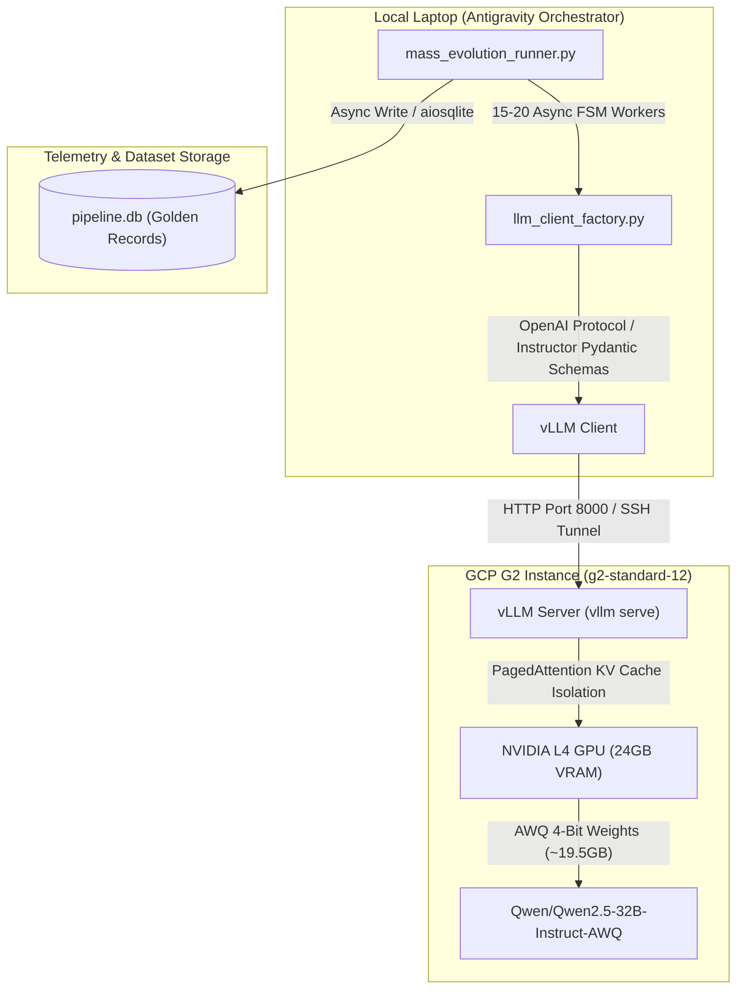

# GCP GPU & vLLM Orchestration Guide (InboxEval 13-Step Engine)

## Executive Summary
This document provides the definitive, single-source-of-truth blueprint for hosting **`Qwen/Qwen2.5-32B-Instruct-AWQ`** on a Google Cloud Platform (GCP) G2 instance to power the InboxEval 13-Step Golden Dataset Evolutionary Engine. 

By leveraging an **NVIDIA L4 GPU (24GB VRAM)** with **vLLM PagedAttention**, the infrastructure supports 15–20 concurrent async FSM coroutines without Key-Value (KV) cache memory cross-contamination. Antigravity acts as the automated remote orchestrator over SSH.

---

## 1. Architecture Blueprint



---

## 2. In-Depth Execution Steps

### Phase 1: VM Instance Configuration (GCP Console)
The instance is provisioned with high CPU RAM headroom to ensure PyTorch model loading and CPU vectorization (Step 02 `sentence-transformers`) run without host memory pressure.

* **Instance Name:** `inbox-eval-engine`
* **Region / Zone:** `us-central1` (or any zone with available L4 quota)
* **Machine Series:** **G2**
* **Machine Type:** **`g2-standard-12`** (12 vCPUs, 48 GB System RAM, 1x NVIDIA L4 GPU 24GB VRAM)
* **Boot Disk:**
  * **Operating System:** Deep Learning on Linux
  * **Version:** `Deep Learning VM with CUDA + Pytorch M132` (Ubuntu 22.04, CUDA 12.9)
  * **Disk Type & Size:** SSD Persistent Disk — **120 GB**
  * **GPU Driver:** Check *"Install NVIDIA GPU driver automatically on first boot"*
* **Firewall:** Allow HTTP & HTTPS traffic.

---

### Phase 2: Automated SSH Key Pairing & Config
To enable seamless remote execution by Antigravity from the local Mac:

1. **Generate Project Keypair on Mac:**
   ```bash
   ssh-keygen -t ed25519 -f ~/.ssh/gcp_inbox_eval -N "" -C "hitesh@inboxeval"
   ```
2. **Add Public Key to GCP Console:**
   Copy `~/.ssh/gcp_inbox_eval.pub` into **VM Instance -> Edit -> SSH Keys**.
3. **Configure SSH Alias (`~/.ssh/config`):**
   ```sshconfig
   Host inbox-engine
       HostName <YOUR_VM_EXTERNAL_IP>
       IdentityFile ~/.ssh/gcp_inbox_eval
       User hitesh
       StrictHostKeyChecking no
   ```

---

### Phase 3: vLLM Server Deployment & Launch
Once SSH access is established, Antigravity executes the following commands on the remote VM:

1. **Verify GPU Status:**
   ```bash
   nvidia-smi
   ```
2. **Create Python Virtual Environment & Install vLLM:**
   ```bash
   python3 -m venv vllm-env
   source vllm-env/bin/activate
   pip install --upgrade pip
   pip install vllm instructor openai
   ```
3. **Start the vLLM OpenAI-Compatible API Server:**
   ```bash
   vllm serve Qwen/Qwen2.5-32B-Instruct-AWQ \
       --host 0.0.0.0 \
       --port 8000 \
       --quantization awq \
       --max-model-len 8192 \
       --gpu-memory-utilization 0.90 \
       --enable-auto-tool-choice \
       --tool-call-parser pythonic
   ```
   * **`--quantization awq`:** Compresses weights to ~19.5 GB VRAM.
   * **`--gpu-memory-utilization 0.90`:** Reserves 90% of 24GB VRAM (~21.6 GB) for weights + PagedAttention KV cache.
   * **`--enable-auto-tool-choice --tool-call-parser pythonic`:** Enables `instructor` native Pydantic schema structured outputs across Steps 01–12.

---

### Phase 4: InboxEval Engine Client Integration
Update `src/engine/golden_dataset_generator/config.py` and `utils/llm_client_factory.py` (or `.env` environment variables):

```env
OPENAI_BASE_URL=http://<YOUR_VM_EXTERNAL_IP>:8000/v1
OPENAI_API_KEY=vllm-dummy-key
GENERATION_MODEL=Qwen/Qwen2.5-32B-Instruct-AWQ
CLASSIFICATION_MODEL=Qwen/Qwen2.5-32B-Instruct-AWQ
```

---

### Phase 5: Mass Evolution & Golden Dataset Export
Run the 13-step evolutionary loop inside a `tmux` session to ensure uninterrupted execution:

```bash
# Launch mass evolution runner across 20 concurrent coroutines
python3 -m scripts.mass_evolution_runner
```
* **Step 01–03:** Ingestion, Backtranslation, Sentence-Transformers vectorization.
* **Step 04–06:** DPBC threshold calculation, adversarial persona synthesis, genesis mutations.
* **Step 07–11:** Reward hack evaluation, KDA matrix ranking, critique, crossover, elitism.
* **Step 12:** Convergence check & async export into `pipeline.db`.

---

### Phase 6: Autonomous Overnight GCP VM Execution & Cloud Persistence Architecture

To guarantee uninterrupted 24/7 execution when your local machine goes offline:

1. **VM Data Autonomy**:
   * All 497,500 raw emails, 44,774 backtranslated records (`data/pipeline.db`), and 768-dim vector embeddings (`data/chroma_db`) are synced directly to `~/InboxEval/data/` on the GCP VM.
2. **24/7 `tmux` Process Isolation**:
   * `vLLM` server runs in `tmux` session `vllm`.
   * `mass_evolution_runner.py` (20 parallel coroutines) runs in `tmux` session `evolution`.
   * Closing local laptop lids or SSH disconnections will **not** interrupt execution.
3. **Forever-Free Cloud Database & Checkpointing**:
   * Automatic periodic syncs export completed Golden Records to free cloud storage / Turso serverless SQLite database (`libsql://`), ensuring the Golden Dataset lives forever for free even after deleting the GCP VM.
   * Enables remote inspection from any laptop via DBeaver, TablePlus, or Python.

---

### Phase 7: FP8 KV-Cache & Chunked Prefill High-Throughput Optimization

To maximize token generation throughput and double simultaneous request concurrency on a single NVIDIA L4 GPU (24GB VRAM):

#### 1. Architectural Upgrade
* **FP8 KV-Cache (`--kv-cache-dtype fp8`)**: Quantizes Key-Value attention matrices in GPU VRAM from 16-bit FP16 to 8-bit FP8 (`fp8_e4m3`). This reduces KV-cache memory overhead by 50%, expanding available KV-cache capacity from ~9,500 tokens to ~19,000 tokens.
* **Impact**: Increases active simultaneous GPU execution slots from 14 requests to ~28–30 requests per forward pass without output quality degradation.
* **Chunked Prefill (`--enable-chunked-prefill`)**: Chunks large prompt prefill computations to allow prompt evaluation and token decoding to execute concurrently in the same GPU forward pass, eliminating prompt evaluation latency stalls.
* **Prefix Caching (`--enable-prefix-caching`)**: Hashes and reuses static system prompt headers across persona mutations, reducing redundant prompt token computation.

#### 2. Optimized vLLM Launch Command
```bash
vllm serve Qwen/Qwen2.5-32B-Instruct-AWQ \
    --host 0.0.0.0 \
    --port 8000 \
    --quantization awq \
    --max-model-len 4096 \
    --gpu-memory-utilization 0.95 \
    --kv-cache-dtype fp8 \
    --enable-chunked-prefill \
    --enable-prefix-caching \
    --enforce-eager \
    --enable-auto-tool-choice \
    --tool-call-parser pythonic
```

#### 3. Verification Protocol
Monitor live telemetry via `http://localhost:8000/metrics`:
* **`vllm:num_requests_running`**: Verifies active GPU batch capacity expands from 14 to ~28-30.
* **`vllm:kv_cache_usage_perc`**: Verifies memory utilization remains stable below 95%.
* **`golden_dataset` Output Rate**: Tracks super prompt generation throughput (target: ~180-220 emails/hour).


