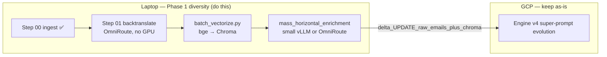

# Implementation Plan: Phase 1 Diversity Fix & Horizontal Pipeline

## Executive summary

Phase 1 is **not** only backtranslation. It is a **horizontal pre-engine lane** that must produce rows in `raw_emails` with: base super-prompt fields (`prompt`, `context`), **11-axis persona JSON**, **DPBC targets**, and **Chroma KNN coverage**—before Engine v4 can evolve “super prompts” on a balanced length mix.

**Where numbers come from (read this first):**

| Source | Path | Use for |
|--------|------|---------|
| **GCP VM (authoritative while Engine runs)** | `/home/hitesh/InboxEval/data/pipeline.db` | `golden_dataset`, live Engine progress, enrichment at scale |
| **Mac — canonical path (what Python uses)** | `data/pipeline.db` | `pipeline_db.py` and most scripts point here only |
| **Mac — your GCP enrichment sync** | `data/pipeline_phase1_completed.db` | **47,978** `dpbc_targets` (matches GCP enrichment snapshot from **2026-08-09**) |
| **Mac — partial GCP backup** | `data/pipeline_backup_gcp.db` | **22,190** dpbc (mid-sync snapshot, same date) |

You **did** sync bulk enrichment locally — it lives in **`pipeline_phase1_completed.db`**, not in the file most tooling opens by default. As of **2026-08-11**, `data/pipeline.db` on disk is still an **older** snapshot (**2,090** dpbc, **1,058** golden) from **2026-08-09 02:36**, while `pipeline_phase1_completed.db` was written **later that day (12:14)** with full dpbc.

| File (Mac `data/`) | Modified | dpbc | golden | Notes |
|--------------------|----------|-----:|-------:|-------|
| `pipeline.db` | Aug 9 02:36 | 2,090 | 1,058 | Default path — **misleading for dpbc** |
| `pipeline_backup_gcp.db` | Aug 9 03:12 | 22,190 | 958 | Partial pull |
| `pipeline_phase1_completed.db` | Aug 9 12:14 | **47,978** | 958 | **Enrichment-complete mirror** |
| GCP live (Aug 11) | running | **47,978** | **2,355** | Engine has added ~1.4K golden since Aug 9 |

**Fix for local analysis:** either query `pipeline_phase1_completed.db` explicitly, or replace the canonical file after rsync:

```bash
# After rsync from VM into a temp name:
cp data/pipeline.db data/pipeline.db.bak
# or: mv data/pipeline_from_gcp.db data/pipeline.db
```

SSH (from `.env`: `GCP_VM_USER`, `GCP_VM_EXTERNAL_IP`, `GCP_VM_SSH_KEY`):

```bash
ssh -i ~/.ssh/gcp_inbox_eval hitesh@34.134.66.200
```

Verified on GCP **2026-08-11** via Python `sqlite3` (VM has no `sqlite3` CLI):

| Metric | GCP value | Mac `pipeline.db` | Mac `pipeline_phase1_completed.db` |
|--------|-----------|-------------------|-------------------------------------|
| Total ingested | **497,500** | same | same |
| `golden_dataset` rows (Engine **finished** super-prompt runs) | **2,355** (micro 2,325, medium 28, long 2) | **1,058** — behind GCP | **958** — Aug 9 engine snapshot |
| `raw_emails.status='completed'` | **2,355** (matches golden; Engine flips status when done) | 959 | 958 |
| `raw_emails` with `dpbc_targets` set (Phase 1 **horizontal** enrichment) | **47,978** | **2,090** (wrong file for dpbc) | **47,978** ✓ |
| `status='backtranslated'` (queued for / in Engine) | **46,075** — **all micro** | similar micro skew |
| Non-micro still `pending` (never backtranslated) | short 243,084 + medium 85,812 + long 22,462 + massive 6,935 | same ingest |
| `locked_v4` (Engine v4 sampler hold) | **476** | — |

**Three different columns — not the same thing:**

1. **`prompt`** (Step 01 backtranslation): simple “original instruction” text. On GCP, among `status='backtranslated'`, **40,222** have a non-empty `prompt` and **5,853** do not (failed/partial Step 01 JSON, or never persisted). Enrichment can still run using `clean_text` / persona extraction; missing `prompt` does **not** mean missing `dpbc_targets`.
2. **`dpbc_targets`** (horizontal enrichment): JSON calibration targets from persona + Chroma KNN. **~48K micro rows on GCP** have this; almost the entire backtranslated micro pool is enriched. This is **not** “golden records.”
3. **`golden_dataset`** (vertical Engine v4): evolved super-prompt output. **2,355** rows on GCP — a **subset** of enriched emails that completed the FSM (`raw_emails.status='completed'`).

So “2,090 dpbc” vs “2,355 golden” was never a logical contradiction: they were **different metrics on different databases**. On GCP, **dpbc ≫ golden** (tens of thousands enriched, ~2.3K fully evolved).

**Conclusion (unchanged strategically):** Step 00 ingest is done. Backtranslation + enrichment ran at **micro scale on GCP** (~46K+ in the Engine queue). **Non-micro is still untouched** (`pending`). Diversity backtranslate/enrich still belongs on the **laptop** (OmniRoute + batches), then **delta-sync** enrichment columns (+ Chroma) to GCP via `scripts/sync_delta_to_gcp.py`; keep the Engine VM running. Do **not** full-file rsync `pipeline.db` while golden records exist on GCP.

---

## Step 0 vs scripts: what “Phase 1” actually includes

There is one **ingest script** and several **downstream horizontal scripts**. Do not confuse legacy JSONL `step_02_vectorize.py` with the production SQLite path.

### Step 00 — Ingest (download + sanitize + categorize)

| Sub-step | Where | Status | Include in Phase 1? |
|----------|--------|--------|---------------------|
| Download Enron corpus (HuggingFace) | `scripts/data_pipeline/step_00_download_dataset.py` | **Done** (~497.5K rows) | **Yes** — prerequisite; no re-run unless DB lost |
| Clean forwards/boilerplate | same | **Done** | **Yes** — baked into ingest |
| Word count + `size_category` + `status='pending'` | same | **Done** | **Yes** — drives all sampling |

**Evidence:** Full row count matches expected corpus scale; pending rows exist in all five categories.

### Step 01 — Backtranslation (super-prompt seed)

| Item | Script | Backend | Include? |
|------|--------|---------|----------|
| `{prompt, context, target_persona}` JSON | `scripts/data_pipeline/step_01_backtranslate.py` | **OmniRoute** (`step_01_combo`) | **Yes — critical** |
| Sets `status='backtranslated'` | same | — | **Yes** |

**Evidence:** 243,084 **short** still `pending`; 0 short backtranslated. SQL in repo already unions all categories, but the **observed DB state** shows only micro completed—likely an earlier micro-only run, an interrupted mega-batch that exhausted micro quota first, or OmniRoute/session stopped before non-micro tasks drained. **Do not rely on one 125K-row blast; use diverse micro-batches (below).**

### Step 02a — Vector index (KNN for DPBC)

| Item | Script | Include? |
|------|--------|----------|
| Legacy JSONL → MiniLM → `enron_emails` | `scripts/data_pipeline/step_02_vectorize.py` | **No** — obsolete path (`data/01_backtranslated.jsonl`) |
| SQLite backtranslated → **BAAI/bge-base-en-v1.5** → `inbox_eval_vectors` | `scripts/data_pipeline/batch_vectorize.py` | **Yes** — required for production DPBC |

**Evidence:** `step_03_vectorization.get_dpbc_thresholds()` reads collection **`inbox_eval_vectors`** under `data/chroma_db` (see `docs/ai_email_eval_framework.md` §11). Enrichment calls this during `mass_horizontal_enrichment.py`. Without upserting new IDs into Chroma, DPBC falls back to heuristics—**weaker calibration** for new length buckets.

**Recommendation:** After each backtranslate batch (or nightly), run `batch_vectorize.py` incrementally (it upserts by email `id`). CPU/GPU-light on laptop compared to vLLM persona extraction.

### Step 02b — Enrichment (11-axis persona + DPBC)

| Item | Script | Backend | Include? |
|------|--------|---------|----------|
| Full `PersonaProfileV3` + `dpbc_targets` on `raw_emails` | `scripts/mass_horizontal_enrichment.py` | vLLM @ `localhost:8000` in script | **Yes — critical** for Engine v4 sampler |

**Evidence (GCP):** **47,978** rows have `dpbc_targets` (micro-heavy). Engine v4 `DiversitySampler.get_next_batch()` requires `status='backtranslated' AND dpbc_targets IS NOT NULL` — on GCP that is **46,075** micro rows waiting ahead of non-micro (which are still `pending`, so they never enter this query). Mac `data/pipeline.db` showing **2,090** dpbc is an **old partial copy**, not live Engine state.

**GCP constraint:** Do **not** run heavy enrichment on the GCP L4 while Engine v4 is saturating GPU. Run enrichment on **laptop** (small model / low concurrency) or **OmniRoute** for persona if vLLM is unavailable on 1080.

---

## Architecture: two compute lanes



---

## Strategy: small diverse batches (your proposal — recommended)

**Goal:** Whenever you stop (rate limits, sleep, crash), the DB should contain a **mix of lengths** with the full horizontal artifact chain—not another 48K micro monoculture.

### Principles

1. **Stop targeting micro for backtranslation.** You already have ~48K micro backtranslated; only ~931 micro golden records exist. Treat the rest of micro backtranslated rows as **optional legacy** unless you later filter “has valid prompt + enriched + engine completed.”
2. **Per “session batch”, round-robin by `size_category`**, e.g. short → medium → long → massive, fixed small N each (not 50K micro in one query).
3. **Mirror the same pattern for enrichment:** each chunk takes K emails **stratified by category** among `backtranslated AND dpbc_targets IS NULL`.
4. **Vectorize incrementally** after each backtranslate session so KNN includes new length diversity.
5. **Sync enrichment via `scripts/sync_delta_to_gcp.py`** when batches are fully ready (`prompt`+`target_persona`+`dpbc_targets`)—never full-file replace of GCP `pipeline.db`.

### Suggested batch quotas (one “session” — small batches)

Use **tiny stratified slices** so OmniRoute rate limits and crashes never waste a huge queue. Default **one session**:

| Category | Backtranslate | Enrich (same slice) |
|----------|--------------:|--------------------:|
| short | **30** | **30** |
| medium | **20** | **20** |
| long | **8** | **8** |
| massive | **2** | **2** |
| micro | **0** | **0** |
| **Total per session** | **~60 emails** | **~60 emails** |

Run many sessions per day (e.g. 5–10 × 60 = 300–600 non-micro emails/day) instead of one giant pull.

**Enrichment chunk size on secondary laptop:** match the same stratified totals (e.g. `--chunk-size 60` with per-category caps), concurrency **~5** on a 1080-class GPU.

### Pipeline overlap (1 primary + 1 secondary — you do **not** idle the GPU)

You do **not** need to finish all backtranslation before **any** enrichment starts. You only need **per-email ordering** for one field (see below).

```text
Session N (primary + OmniRoute):  backtranslate ~60 pending → backtranslated
Session N−1 leftovers (secondary): enrich / vectorize the ~60 from yesterday’s session
         ↑ same DB, different email IDs — run in parallel
```

| Step | Needs backtranslate first? | Why |
|------|------------------------------|-----|
| **Persona (11-axis)** | **No** for *data* — uses `clean_text` already on `pending` rows | LLM reads the raw email, not the backtranslated prompt |
| **DPBC targets** | **No** for *data* — needs persona + Chroma KNN on email text | KNN uses existing ~48K micro vectors + new vectors as you add them |
| **Vectorize (Chroma)** | **No** — can embed `clean_text` (optionally after persona) | Helps DPBC for long/massive once those IDs exist in the index |
| **Engine v4 eligibility** | **Yes** — sampler expects `status='backtranslated'` + `dpbc_targets` | Convention + current SQL, not physics |
| **Same row, same time** | **Yes — order matters today** | Step 01 **overwrites** `target_persona` with a short backtranslate string; enrichment writes rich JSON to the same column. If both run on the **same id** without a code fix, the last writer wins and you lose persona or prompt. |

**Practical rule with current scripts:**

1. **Different batches in parallel:** Primary backtranslates **session N** while secondary enriches **session N−1** (already `backtranslated`). Zero idle wait.
2. **Optional code improvement (later):** Step 01 updates only `prompt`, `context`, `status` and leaves `target_persona` alone if `dpbc_targets` is already set — then persona+DPBC could run on `pending` in parallel on the **same** ids. Not required for the two-laptop pipeline above.

**Vectorize timing:** Run on secondary **after** persona for that batch (better metadata) or **immediately after backtranslate** for that id — both work; incremental `batch_vectorize.py` after each enriched slice is enough for DPBC quality.

### What to do with ~46–48K micro backtranslated

| Use case | Action |
|----------|--------|
| Engine v4 diversity | **Ignore for now** — sampler + golden counts are micro-heavy anyway |
| Chroma / DPBC | Already indexed (~44K per docs); no harm leaving them |
| Future | Optionally mark `status='legacy_micro'` or filter `WHERE size_category != 'micro'` in new scripts |

Only micro rows with **`dpbc_targets` + successful Engine run** become true “super prompt” golden records; the rest are cheap horizontal seeds, not benchmark finals.

---

## Code changes (minimal, ordered)

### 1. `step_01_backtranslate.py` — diverse batch mode

Replace the single mega-`UNION ALL` with:

- CLI: `--batch-size-per-category` (defaults: short=30, medium=20, long=8, massive=2) and `--categories short,medium,long,massive`.
- SQL: one subquery per category with `LIMIT :n` and `ORDER BY RANDOM()`.
- Optional: `--max-sessions` or run in a loop until no pending in those categories.
- Keep OmniRoute client; user starts server and logs in.

### 2. `mass_horizontal_enrichment.py` — stratified chunks

- Add `--base-url` (already needed for laptop vs GCP tunnel).
- Replace flat `LIMIT chunk_size` with **stratified fetch** (e.g. `chunk_size // 4` per category per loop).
- Lower default concurrency for GTX 1080 (**5**, not 30).
- Optional: `--use-omniroute` for persona extraction when local vLLM cannot run 32B.

### 3. `batch_vectorize.py` — incremental

- Add `WHERE id NOT IN (...)` or track vectorized IDs via Chroma `get` to skip re-encode (optional optimization).
- Run after each backtranslate session.

### 4. `diversity_sampler.py` (Engine v4 on GCP) — bug fix **before** relying on sampler

**Evidence:** DB stores lowercase categories (`micro`, `short`, …); sampler uses `["LONG", "MEDIUM", "MICRO"]` → **never matches**, falls back to arbitrary rows.

```diff
- categories = ["LONG", "MEDIUM", "MICRO"]
+ categories = ["short", "medium", "long", "massive", "micro"]
```

Deploy this fix to GCP when syncing code; Engine will then prefer underrepresented lengths in **enriched** pool.

### 5. Do **not** modify GCP Engine runner cadence

Only feed it a better `pipeline.db` over time.

---

## Parallel batch harvest + safe GCP sync (implemented)

### Column / store ownership (factual)

| Step | Script | SQLite writes | Chroma |
|------|--------|---------------|--------|
| Claim | `scripts/claim_diversity_batch.py` | `diversity_batch` rows only | — |
| 01 | `scripts/data_pipeline/step_01_backtranslate.py` | `prompt`, `context`, `status` only (OmniRoute) | none |
| 02b | `scripts/data_pipeline/batch_vectorize.py` | **READ ONLY** | exclusive lock + upsert |
| 02a | `scripts/mass_horizontal_enrichment.py` | `target_persona`, `dpbc_targets` (one UPDATE) | wait/retry lock then read for DPBC |
| Sync | `scripts/sync_delta_to_gcp.py` | local `sync_log` only | rsync under lock after SQL |

Lock helper: `scripts/data_pipeline/chroma_lock.py` → `data/chroma_db/.chroma_access.lock` (fcntl flock, wait/retry up to 30 min).

### Operator runbook (one session)

```bash
# 1) Claim stratified 60 (30/20/8/2)
python3 scripts/claim_diversity_batch.py
# export BATCH_ID=... from output

# 2) Parallel OK — Step 01 does not touch Chroma
python3 scripts/data_pipeline/step_01_backtranslate.py --batch-id $BATCH_ID &
python3 scripts/data_pipeline/batch_vectorize.py --batch-id $BATCH_ID
wait

# 3) After 02b preferred; if early, 02a waits on chroma lock then continues (no drop)
python3 scripts/mass_horizontal_enrichment.py --batch-id $BATCH_ID

# 4) Delta sync ONLY (never full pipeline.db rsync — protects golden_dataset)
python3 scripts/sync_delta_to_gcp.py --verify --batch-id $BATCH_ID
```

Env for Step 01: `OMNIROUTE_BASE_URL` (default `http://localhost:20128/v1`), `OMNIROUTE_API_KEY`, `OMNIROUTE_MODEL` (default `step_01_combo`).  
Env for Step 02a: `OLLAMA_SECONDARY_LAPTOP_BASE_URL`, `OLLAMA_SECONDARY_LAPTOP_MODEL`.

### Concurrency rules

1. **SQLite:** Step 01 and 02a may run together; different columns; `busy_timeout=30000` + WAL on writers.
2. **Chroma:** 02b then 02a. If 02a starts early it **waits/retries** on the lock — does not exit and drop the batch. Rows with `dpbc_targets IS NULL` remain resumable.
3. **GCP Engine:** Keep running. Sync uses `BEGIN IMMEDIATE` + `UPDATE raw_emails ... AND status='pending'`. Never references `golden_dataset`. Verifies golden COUNT unchanged when `--verify`.

### Do not

- Full-file `rsync` of `data/pipeline.db` Mac → GCP while Engine has golden progress.
- Split 02a into separate persona vs DPBC pipeline steps (rejected: more SQLite writes, no quality gain).

---

## Execution checklist (what you should do)

### Today — laptop

1. Start **OmniRoute**; confirm `step_01_combo` routes to FFI-passing models (`scripts/model_eval/ffi_tester.py` if unsure).
2. Run **claim + Step 01 + 02b in parallel + 02a** per runbook above (~60 emails/session, exclude micro).
3. Secondary laptop serves **Ollama** for Step 02a only (persona+DPBC); vectors (02b) run on Mac under chroma lock.

### After each meaningful batch

5. Verify SQL:

```bash
python3 -c "
import sqlite3
c=sqlite3.connect('data/pipeline.db')
print(c.execute('''
SELECT size_category, status, COUNT(*) FROM raw_emails
WHERE size_category IN (\"short\",\"medium\",\"long\",\"massive\")
GROUP BY size_category, status ORDER BY 1,2
''').fetchall())
print(c.execute('''
SELECT size_category, COUNT(*) FROM raw_emails
WHERE dpbc_targets IS NOT NULL AND dpbc_targets != \"\"
GROUP BY size_category
''').fetchall())
"
```

7. **Delta sync** via `scripts/sync_delta_to_gcp.py --verify --batch-id $BATCH_ID` (SQL enrichment + Chroma). Do **not** replace GCP `pipeline.db` wholesale.

### GCP (low risk)

8. Deploy **`diversity_sampler.py` case fix** only; restart Engine v4 runner if needed.
9. Tail logs for `Targeting least represented category: short` (or medium/long/massive).

### Explicit non-goals

- Re-run Step 00 download unless DB is corrupt.
- Use legacy `step_02_vectorize.py` JSONL pipeline.
- Run Qwen-32B enrichment on GCP alongside full Engine load.
- Backtranslate another 50K micro in one shot.

---

## Verification targets (definition of “Phase 1 diversity unblocked”)

| Check | Target |
|-------|--------|
| Non-micro `backtranslated` | **> 0** in short, medium, long, massive (then grow steadily) |
| Non-micro with `dpbc_targets` | Same categories **> 0** |
| `golden_dataset` by `size_category` | short/medium/long/massive **monotonically increasing** after GCP sync |
| Sampler log | Least-represented category rotates across lowercase buckets |
| Engine idle starvation | No long periods of “0 rows” because only micro had `dpbc_targets` |

---

## Open decisions (defaults assumed above)

| Question | Recommended default |
|----------|---------------------|
| Enrichment on 1080 4GB | **Qwen2.5-3B/7B local** @ concurrency 5, **or** OmniRoute for persona |
| Long/massive caps | Raise vs old 1K/250; use **session caps** instead of one-shot LIMIT |
| Micro legacy ~48K | **Do not delete**; exclude from new batch queries |
| OmniRoute | **Primary** for Step 01; user starts server manually |

---

## Related docs

- Horizontal Phase 1 definition: `docs/ai_email_eval_framework.md` (§11–12, Engine v2 Phase 1 diagram)
- Engine v4 bugs/sampler context: `docs/implementation_plan_engine_v4.md`
- GCP sync: `docs/gcp_gpu_setup_guide.md`

---

*Plan lives in `docs/implementation_plan_diversity_fix.md`. Live counts: query GCP `pipeline.db` over SSH (see above). Mac local DB is for offline dev unless delta-synced.*
